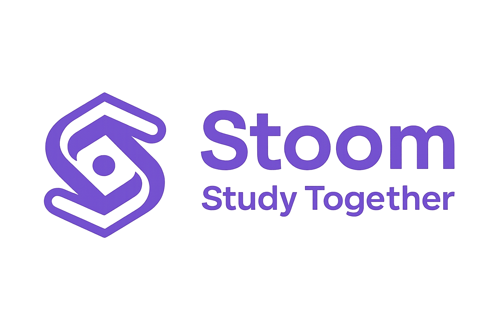

# Stoom — Real-Time Video Conferencing Platform



A full-featured video conferencing web application with collaborative whiteboard, chat, and notes — built with Next.js and LiveKit.

> Academic project developed by a university student for learning and demonstration purposes.

---

## Description

Stoom is a browser-based video conferencing platform that enables users to host and join real-time meetings. It solves the need for an integrated collaboration space by combining video/audio calls, a shared whiteboard, synchronized notes, and in-room chat in a single application. Users can create password-protected rooms, manage participant roles, and review past sessions through a personal dashboard.

---

## Tech Stack

**Frontend**
- [Next.js 16](https://nextjs.org) (App Router) — React 19, TypeScript
- Tailwind CSS, Radix UI (shadcn/ui component library)
- [tldraw](https://tldraw.com) — collaborative whiteboard canvas
- [Tiptap](https://tiptap.dev) — rich-text editor for personal and collaborative notes

**Authentication**
- [Clerk](https://clerk.com) — user sign-in/sign-up and route protection

**Real-Time Communication**
- [LiveKit](https://livekit.io) — WebRTC server for video, audio, and data channels
- coturn — self-hosted TURN/STUN server

**Database**
- MongoDB via [Prisma ORM](https://www.prisma.io)

**Infrastructure**
- Docker Compose — orchestrates LiveKit and coturn services

---

## Features

- Create and join password-protected meeting rooms with a unique 6-character room code
- Real-time video and audio conferencing with active-speaker highlighting
- Collaborative whiteboard (tldraw) with permission-based access control
- Collaborative notes (Tiptap) shared and synced across all participants in real time
- Personal notes (Tiptap) saved privately per participant and stored to the session
- In-room text chat via LiveKit DataChannel
- Screen sharing support with automatic conflict resolution
- Host and co-host role management: kick participants, lower raised hands, end meetings
- Session history dashboard displaying past meetings and saved notes/whiteboard snapshots

---

## Installation

```bash
# 1. Clone the repository
git clone https://github.com/pho-veteran/stoom.git
cd stoom

# 2. Install dependencies
npm install

# 3. Start LiveKit and TURN server
docker compose up -d

# 4. Configure environment variables
# Create a .env file with the following values:
#   DATABASE_URL                        — MongoDB connection string
#   NEXT_PUBLIC_CLERK_PUBLISHABLE_KEY   — Clerk publishable key
#   CLERK_SECRET_KEY                    — Clerk secret key
#   LIVEKIT_API_KEY                     — LiveKit API key
#   LIVEKIT_API_SECRET                  — LiveKit API secret
#   LIVEKIT_URL                         — LiveKit HTTP URL for server-side SDK (http://localhost:7880)
#   NEXT_PUBLIC_LIVEKIT_URL             — LiveKit WebSocket URL for client (ws://localhost:7880)

# 5. Run the development server
npm run dev
```

Open [http://localhost:3000](http://localhost:3000) in your browser.

---

## Project Structure

```
app/
  (auth)/          — Sign-in and sign-up pages (Clerk)
  (dashboard)/     — Dashboard and session history pages
  (room)/          — Pre-join screen and live meeting room
  api/             — Next.js API routes (room CRUD, LiveKit token/webhook, chat)
components/
  room/            — All in-room UI: stage, sidebar, toolbar, whiteboard, chat, notes
  dashboard/       — Dashboard header and sidebar
  session/         — Session review components (notes viewer, whiteboard snapshot)
lib/               — Server utilities: Prisma client, LiveKit SDK helpers, permissions
hooks/             — Custom React hooks for room state, chat, hand raise, screen share
prisma/            — Prisma schema (MongoDB: User, Room, RoomParticipant, ChatMessage)
```

---

## Author

Developed by **pho-veteran** as a university student project.  
GitHub: [github.com/pho-veteran](https://github.com/pho-veteran)
