# Chapter 2: System Analysis and Design

## 2.1. System Requirements

### 2.1.1. Actors

The system employs an inheritance-based actor model (Generalization/Specialization) to define user roles and system entities. The base actor is the **User**, which represents any authenticated individual accessing the platform through Clerk authentication. Specialized actors inherit from this base class, each with distinct permissions and responsibilities.

#### Base Actor: User

The **User** actor is the fundamental entity in the system, representing any authenticated individual. All users must authenticate through Clerk before accessing protected features. The User actor has the following base attributes:
- Authentication status (managed by Clerk)
- User ID (Clerk user ID)
- Email address
- Profile information (name, avatar)

#### Specialized Actor: Room Host

The **Room Host** is a specialized User who creates a meeting room. This actor inherits all capabilities of the base User class and additionally possesses administrative privileges within the room context. The Room Host has the following specialized capabilities:
- Create new meeting rooms with custom settings (title, password, media preferences, whiteboard restriction)
- Control room settings during an active session
- Manage collaboration permissions (whiteboard, notes access control)
- Grant or revoke whiteboard/notes editing access to specific participants
- Kick (remove) participants from the meeting
- Grant or revoke co-host privileges to participants
- End the meeting session
- Save whiteboard snapshots and notes to the database

#### Specialized Actor: Co-Host

The **Co-Host** is a specialized User who has been granted elevated privileges by the Room Host. This actor inherits Participant capabilities and additionally has management rights. The Co-Host can:
- Manage collaboration permissions (whiteboard, notes access control)
- Grant or revoke whiteboard/notes editing access to specific participants
- Kick (remove) participants from the meeting
- End the meeting session
- Lower raised hands of participants

#### Specialized Actor: Participant

The **Participant** is a specialized User who joins an existing meeting room. This actor inherits base User capabilities but has limited administrative rights. The Participant can:
- Join rooms via room code or direct link
- Participate in real-time collaboration (video, audio, whiteboard, notes)
- Send chat messages
- Use whiteboard and notes based on permission settings
- Raise hand to get attention from host/co-host
- Leave the room at any time
- Cannot modify room settings or control other participants

### 2.1.2. Functional Requirements

Functional requirements are organized into logical modules that represent distinct subsystems of the Stoom platform. Each module contains specific requirements labeled with the format **REQ-X.Y**, where X represents the module number and Y represents the requirement number within that module.

#### Module 1: Authentication and User Management

**REQ-1.1:** The system shall authenticate users through Clerk authentication service, supporting email/password and social login methods (Google, GitHub).

**REQ-1.2:** The system shall protect all routes under `(dashboard)` and `(room)` route groups using Clerk middleware, redirecting unauthenticated users to `/sign-in`.

**REQ-1.3:** The system shall provide sign-in and sign-up pages (`/sign-in`, `/sign-up`) with centered card layout, gradient background, and custom violet-themed styling matching the brand identity.

**REQ-1.4:** Upon successful authentication, the system shall redirect users to `/dashboard` automatically.

**REQ-1.5:** The system shall display a UserButton component in the dashboard header, allowing users to access their profile and account settings managed by Clerk.

#### Module 2: Room Management and Navigation

**REQ-2.1:** The system shall provide a "Join with Code" dialog on the dashboard, allowing users to enter a room code and navigate to `/room/[roomCode]`.

**REQ-2.2:** The system shall provide a "New Meeting" dialog that allows Room Hosts to:
- Set a meeting name (required field)
- Optionally set a room password for access control
- Optionally restrict whiteboard access (only host can edit by default)
- Generate a unique 6-character room code via `/api/room/create`
- Persist room to MongoDB with status WAITING and initial permission settings
- Navigate to the room after creation

**REQ-2.3:** The system shall validate room access via `/api/room/validate` endpoint:
- Check room existence (return 404 if not found)
- Check room status (return 410 if ENDED or inactive)
- Perform stale room cleanup (mark ACTIVE rooms as ENDED if no LiveKit room exists for 5+ minutes)
- Return room info including: code, name, isHost, hasPassword

**REQ-2.4:** The system shall provide a pre-join screen (`/room/[roomId]`) before entering the main room:
- Display video preview with camera feed (or user avatar if camera off)
- Show user's Clerk profile image when camera is disabled
- Toggle microphone and camera before joining
- Display password input field if room has password (hidden for host)
- Show room name and navigation back to dashboard

**REQ-2.5:** The system shall manage room lifecycle through LiveKit webhooks (`/api/livekit/webhook`):
- `room_started`: Update room status to ACTIVE, set startedAt timestamp
- `room_finished`: Update room status to ENDED, set endedAt timestamp, mark all participants as left
- `participant_joined`: Create/update RoomParticipant record with role (HOST or PARTICIPANT)
- `participant_left`: Update RoomParticipant leftAt timestamp

**REQ-2.6:** The system shall allow Room Hosts to end meetings via "End Meeting" button:
- Display confirmation dialog before ending
- Broadcast ROOM_ENDED message to all participants via LiveKit DataChannel
- Call `/api/room/end` to delete LiveKit room and update database
- Show "Meeting Ended" overlay to all participants with countdown and redirect

**REQ-2.7:** The system shall provide a Hand Raise feature for participants:
- Participants can raise/lower their hand via a button in the meeting controls
- Raised hands are displayed with a visual indicator (hand icon) on participant cards
- Host and co-hosts see a hand raise queue showing participants in order of when they raised their hand
- Host and co-hosts can lower individual participant's hands or lower all hands at once
- Hand raise state is synchronized in real-time via LiveKit DataChannel
- Screen reader announcements are provided for accessibility

**REQ-2.8:** The system shall allow Room Hosts and Co-Hosts to kick (remove) participants:
- Display a kick button on participant cards (visible only to host/co-hosts)
- Show confirmation dialog before kicking a participant
- Send PARTICIPANT_KICKED message to the kicked participant via LiveKit DataChannel
- Remove participant from LiveKit room via `roomService.removeParticipant()`
- Display "You have been removed from the meeting" overlay to the kicked participant
- Host cannot be kicked from the meeting

**REQ-2.9:** The system shall allow Room Hosts to manage Co-Host privileges:
- Host can grant co-host role to any participant via the Collaboration Settings modal
- Host can revoke co-host role from any co-host
- Co-host status is persisted in the database (RoomParticipant.role = "CO_HOST")
- Co-host changes are broadcast to all participants via LiveKit DataChannel
- Co-hosts have elevated permissions: can manage whiteboard/notes access, kick participants, end meeting, lower hands

**REQ-2.10:** The system shall support room password management during active sessions:
- Host can set, change, or remove room password via the Collaboration Settings modal
- Password validation is performed via `/api/livekit/token` endpoint during join
- Host is exempt from password validation when joining their own room
- Password must be at least 4 characters when set
- Password is stored securely using bcrypt hashing in the database
- API endpoints: `GET /api/room/[roomId]/password` (check if password exists), `PUT /api/room/[roomId]/password` (set/update/remove password)

#### Module 3: Real-time Collaboration (LiveKit Integration)

**REQ-3.1:** The system shall connect to LiveKit server for real-time video/audio communication:
- Generate LiveKit access tokens via `/api/livekit/token` with user identity and metadata (imageUrl)
- Use `@livekit/components-react` library for room connection and media handling
- Sync user data to MongoDB during token generation (upsert clerkId, name, email, imageUrl)

**REQ-3.2:** The system shall implement a multi-panel layout in the room interface:
- **Participants Sidebar (Left, 288px, collapsible):** Displays room code, participant count, and list with avatars
- **Main Stage (Center, flexible width):** Displays video feeds grid, screen share, and/or whiteboard
- **Chat/Notes Panel (Right, resizable):** Tabs for Chat and Personal Notes, can be toggled

**REQ-3.3:** The system shall use `react-resizable-panels` library to enable users to resize panels by dragging resize handles, with hover effects showing violet color on handles.

**REQ-3.4:** The Participants Sidebar shall:
- Display room code with copy-to-clipboard functionality
- Show participant count badge
- Display each participant with: Clerk profile image (or initial avatar), name, "(You)" indicator for local participant
- Show mic/video status icons (green for enabled, red/gray for disabled)
- Highlight active speaker with violet border and "Speaking" label
- Display hand raise indicator (hand icon) for participants with raised hands
- Show role badges (Host, Co-Host) on participant cards
- Display kick button on participant cards for host/co-hosts (with confirmation dialog)
- Show hand raise queue panel for host/co-hosts with "Lower Hand" and "Lower All" actions
- Support collapse/expand functionality

**REQ-3.5:** The Video Feeds View shall:
- Display all participants' video tracks in a responsive grid layout
- Show participant name overlay on each video tile
- Display avatar placeholder when video is disabled
- Highlight active speaker with visual indicator
- Use `@livekit/components-react` VideoTrack component for rendering

**REQ-3.6:** The Screen Share View shall:
- Display screen share track when a participant is sharing
- Show sharer's name in overlay
- Allow any participant to share screen (one at a time)
- Broadcast STOP_SCREEN_SHARE message when another participant wants to take over

**REQ-3.7:** The Chat Panel shall:
- Display scrollable chat messages with sender name, timestamp, and content
- Send messages via LiveKit DataChannel for real-time delivery
- Provide chat input field with Send button
- Auto-scroll to latest messages

**REQ-3.8:** The system shall implement a Floating Dock component at the bottom center:
- Rounded pill shape with backdrop blur and shadow
- Buttons for: Mic toggle, Camera toggle, Screen Share toggle, Whiteboard toggle, Chat toggle, Participants toggle, Leave Room
- "End Meeting" button (red) visible only to Room Host
- Visual feedback: violet background for active states, red for destructive actions
- Confirmation dialogs for Leave Room and End Meeting actions

**REQ-3.9:** The system shall handle meeting end scenarios:
- Host clicks "End Meeting": Broadcast ROOM_ENDED message, show overlay to all participants
- Meeting Ended Overlay: Display "Meeting has ended" message with host name, countdown timer, auto-redirect to dashboard
- Participant clicks "Leave Room": Disconnect from LiveKit, redirect to dashboard

#### Module 4: Collaborative Whiteboard

**REQ-4.1:** The system shall provide a collaborative whiteboard using tldraw library:
- Display tldraw canvas when whiteboard is toggled in the Stage area
- Provide drawing tools: pen, highlighter, eraser, shapes, text, and selection
- Support color and stroke width customization
- Enable image upload with server-side storage (avoids 64KB WebRTC limit)

**REQ-4.2:** The system shall synchronize whiteboard state in real-time:
- Broadcast drawing operations to all participants via LiveKit DataChannel within 100ms
- Apply remote updates to local canvas immediately upon receipt
- Use timestamp-based last-write-wins conflict resolution for concurrent edits
- Synchronize current whiteboard state to new participants joining the room

**REQ-4.3:** The system shall persist whiteboard state:
- Save whiteboard snapshot to localStorage for panel toggle persistence during session
- Load whiteboard state from database when joining a room (fallback when no other participants)
- Allow host/co-host to save whiteboard snapshot to database via API

**REQ-4.4:** The system shall support whiteboard permission control:
- Host can set whiteboard permission to: open (all can edit), restricted (only allowed users), or disabled (hidden)
- Host can grant/revoke whiteboard access to specific participants
- Display whiteboard in read-only mode for users without edit permission
- Hide whiteboard completely when permission is set to disabled

#### Module 5: Personal Notes

**REQ-5.1:** The system shall provide a personal notes editor using Tiptap library:
- Display rich-text editor in the Notes tab of the Chat/Notes panel
- Each user has their own private notes (not shared with other participants)
- Support rich text formatting: bold, italic, strikethrough
- Support heading levels (H1, H2, H3) and paragraph formatting
- Support bullet lists and numbered lists

**REQ-5.2:** The system shall persist personal notes:
- Auto-save notes content to database via `/api/room/[roomId]/notes` endpoint
- Load saved notes when user rejoins the same room
- Each user's notes are stored separately per room (RoomNote model)

**REQ-5.3:** The system shall support notes permission control:
- Host can set notes permission to: open (all can use), restricted (only allowed users), or disabled (hidden)
- Host can grant/revoke notes access to specific participants
- Display notes in read-only mode for users without edit permission
- Hide notes tab completely when permission is set to disabled

#### Module 6: Session History

**REQ-6.1:** The system shall provide a Sessions page (`/sessions`) displaying:
- Grid of past session cards with room name, date, duration, and participant count
- Filter and browse through session history
- Navigate to session detail page by clicking on session cards

**REQ-6.2:** The system shall provide a Session Detail page (`/sessions/[id]`) with:
- Sticky header showing session title, date, time, and duration
- Two-column layout: left (2/3 width) with tabs for Whiteboard and Notes; right (1/3 width) with Participants and Session Statistics cards

**REQ-6.3:** The Whiteboard tab shall display:
- Saved whiteboard snapshot as a static image (PNG)
- Interactive viewer with zoom and pan controls
- Placeholder message if no whiteboard snapshot was saved

**REQ-6.4:** The Notes tab shall display:
- User's personal notes from the session in read-only format
- Rich text rendering with all formatting preserved
- Message if no notes were saved for the session

**REQ-6.5:** The Session Statistics card shall display:
- Duration (calculated from session data)
- Participant count
- Message count

## 2.2. Use Case Diagrams

### 2.2.1. System-Level Use Case Diagram

The system-level use case diagram provides an overall view of the Stoom platform, showing the main functional areas and their relationships with actors. This high-level diagram is simplified to show the three primary use cases, which are then detailed in subsequent subsystem diagrams.

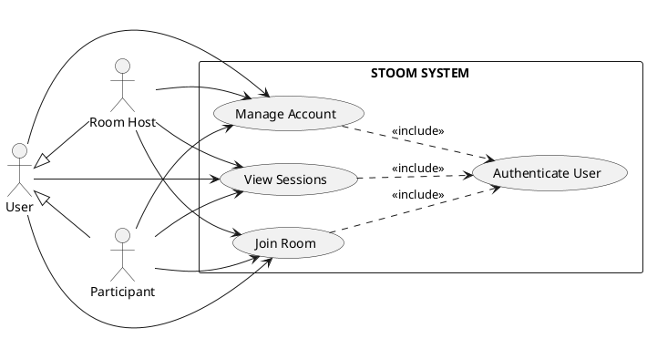

### 2.2.2. Detailed Use Case: Manage Account

This diagram breaks down the "Manage Account" use case from the system-level diagram, showing the detailed interactions for authentication and profile management.

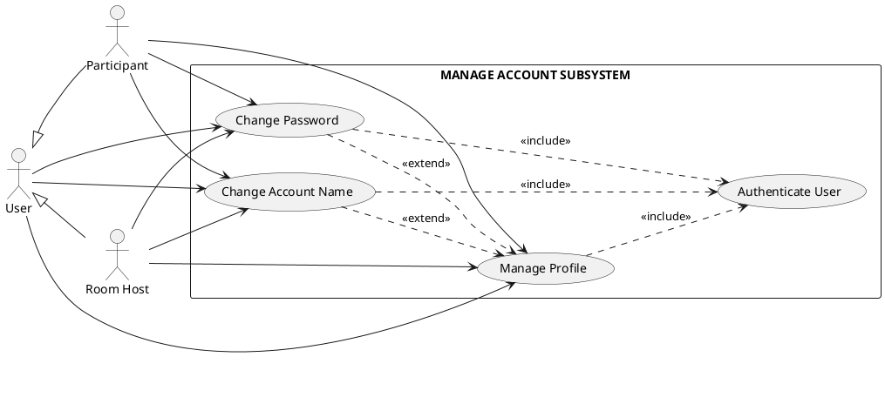

### 2.2.3. Detailed Use Case: Join Room

This diagram breaks down the "Join Room" use case from the system-level diagram, showing the detailed interactions for room creation, joining, password management, and real-time collaboration features.

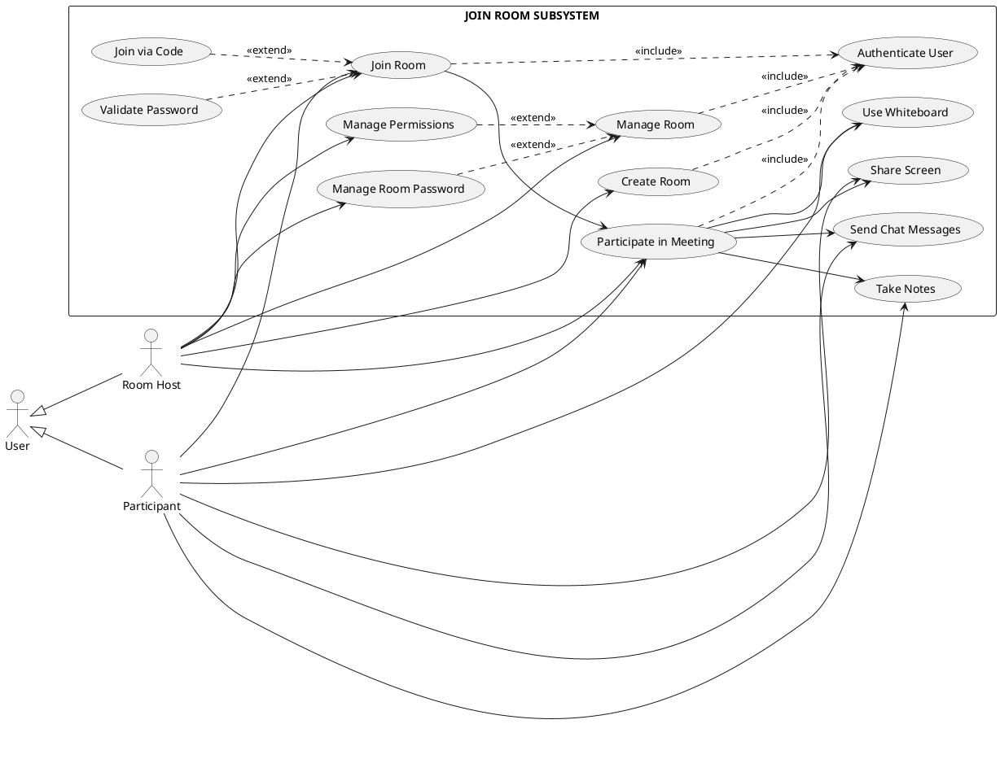

### 2.2.4. Detailed Use Case: View Sessions

This diagram breaks down the "View Sessions" use case from the system-level diagram, showing the detailed interactions for viewing session history and saved collaboration data.

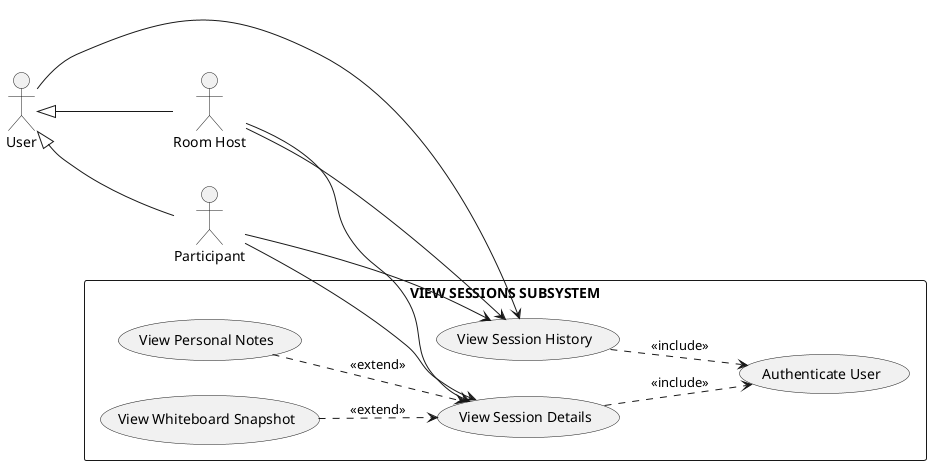

The actors interact with all three subsystems. The Manage Account Subsystem is accessed first for authentication, after which users can access the Join Room Subsystem to participate in collaborative sessions, and the View Sessions Subsystem to review past sessions and saved collaboration data.

### 2.2.5. Detailed Use Case Specifications

Four use cases are detailed below to illustrate the system's core functionality and interaction patterns, including the fundamental authentication use case.

#### Use Case 0: Authenticate User

| **Attribute** | **Description** |
|---------------|-----------------|
| **Use Case Name** | Authenticate User |
| **Actor** | User (base actor) |
| **Description** | A user authenticates with the system through Clerk authentication service, supporting email/password and social login methods (Google, GitHub). Upon successful authentication, the user gains access to protected features of the platform. |
| **Preconditions** | 1. User has a valid account or wishes to create one<br>2. User is on the sign-in or sign-up page<br>3. Clerk authentication service is accessible |
| **Postconditions** | 1. User is authenticated and has an active session<br>2. User is redirected to `/dashboard`<br>3. User can access protected routes and features<br>4. User's authentication status is maintained across the session |
| **Flow** | **Main Flow:**<br>1. User navigates to `/sign-in` or `/sign-up` page<br>2. System displays Clerk authentication interface with custom violet-themed styling<br>3. User selects authentication method (email/password or social login)<br>4. If email/password: User enters email and password, then clicks "Sign In"<br>5. If social login: User clicks social provider button (Google/GitHub) and authorizes<br>6. Clerk validates user credentials or processes social login<br>7. If credentials are valid, Clerk creates/updates user session<br>8. System receives authentication success response from Clerk<br>9. System redirects user to `/dashboard`<br>10. User's authentication status is stored in session<br><br>**Alternative Flow 6a:** If credentials are invalid:<br>6a.1. Clerk returns authentication error<br>6a.2. System displays error message "Invalid credentials"<br>6a.3. User can retry authentication or reset password<br><br>**Alternative Flow 4a:** If user selects "Sign Up" instead:<br>4a.1. User is redirected to `/sign-up` page<br>4a.2. User enters email, password, and confirms password<br>4a.3. Clerk creates new user account<br>4a.4. Continue with step 7<br><br>**Alternative Flow 7a:** If social login authorization is denied:<br>7a.1. User is returned to sign-in page<br>7a.2. User can try again or use email/password method |

#### Use Case 1: Join Room

| **Attribute** | **Description** |
|---------------|-----------------|
| **Use Case Name** | Join Room |
| **Actor** | Participant (specialized User) |
| **Description** | A user joins an existing meeting room by entering a room code or navigating directly to `/room/[roomCode]`. The system validates room existence and status via `/api/room/validate`, displays the pre-join screen with camera/mic preview, validates room password if required, requests a LiveKit token, and connects to the LiveKit room for real-time video/audio communication. |
| **Preconditions** | 1. User is authenticated via Clerk<br>2. Room with the provided code exists in the database<br>3. Room status is WAITING or ACTIVE (not ENDED)<br>4. Room `isActive` flag is true<br>5. LiveKit server is running and accessible |
| **Postconditions** | 1. User is connected to LiveKit room with video/audio streams<br>2. User's data is synced to database via token API (upsert)<br>3. RoomParticipant record is created via LiveKit webhook<br>4. Room status transitions to ACTIVE (via `room_started` webhook)<br>5. User can see other participants and interact with room features |
| **Flow** | **Main Flow:**<br>1. User navigates to `/room/[roomCode]` (via dashboard or direct link)<br>2. System calls `/api/room/validate?code=[roomCode]` to check room status<br>3. API validates: room exists, status is not ENDED, isActive is true<br>4. API performs stale room cleanup (checks LiveKit room existence)<br>5. API returns room info including `hasPassword` flag<br>6. System displays pre-join screen with video preview and media controls<br>7. If room has password and user is not host, system shows password input field<br>8. User optionally toggles microphone and camera<br>9. User enters password (if required) and clicks "Join Room" button<br>10. System calls `/api/livekit/token` with roomName and password (if provided)<br>11. Token API validates password using bcrypt comparison (host is exempt)<br>12. Token API upserts user data to database (clerkId, name, email, imageUrl)<br>13. Token API generates LiveKit access token with user identity and metadata<br>14. Client connects to LiveKit room using token<br>15. LiveKit sends `room_started` webhook (if first participant) → Room status = ACTIVE<br>16. LiveKit sends `participant_joined` webhook → RoomParticipant record created<br>17. System loads room data: permissions via `/api/room/[roomId]/permissions`, chat history<br>18. System initializes collaboration features based on permissions (whiteboard, notes)<br>19. System displays main room interface with participants sidebar, video feeds, and controls<br><br>**Alternative Flow 3a:** If room does not exist:<br>3a.1. API returns 404 with code "ROOM_NOT_FOUND"<br>3a.2. System displays "Room Not Found" error page<br>3a.3. User can navigate back to dashboard<br><br>**Alternative Flow 3b:** If room has ended:<br>3b.1. API returns 410 with code "ROOM_ENDED"<br>3b.2. System displays "Meeting Ended" error page<br>3b.3. User can navigate back to dashboard<br><br>**Alternative Flow 4a:** If stale room detected (ACTIVE but no LiveKit room for 5+ minutes):<br>4a.1. API marks room as ENDED and returns 410<br>4a.2. Continue with Alternative Flow 3b<br><br>**Alternative Flow 11a:** If password is required but not provided:<br>11a.1. Token API returns 401 with code "PASSWORD_REQUIRED"<br>11a.2. System displays password input field<br>11a.3. User enters password and retries<br><br>**Alternative Flow 11b:** If password is incorrect:<br>11b.1. Token API returns 401 with code "INVALID_PASSWORD"<br>11b.2. System displays "Incorrect password" error message<br>11b.3. User can retry with correct password or cancel |

#### Use Case 2: Collaborate on Whiteboard

| **Attribute** | **Description** |
|---------------|-----------------|
| **Use Case Name** | Collaborate on Whiteboard |
| **Actor** | Participant (specialized User) |
| **Description** | A user draws, writes, or adds shapes on the collaborative whiteboard. The system updates the local canvas optimistically, synchronizes changes with other participants in real-time through LiveKit DataChannel, and persists the final state when saved by the host. |
| **Preconditions** | 1. User is in an active room (`/room/[roomId]`)<br>2. Whiteboard is visible in Main Stage<br>3. User has permission to edit whiteboard (based on room permission settings)<br>4. LiveKit DataChannel connection is established |
| **Postconditions** | 1. User's drawing appears on local canvas immediately<br>2. Other participants see the drawing within 100ms network latency<br>3. Whiteboard state is synchronized across all clients<br>4. Whiteboard snapshot can be saved to database by host |
| **Flow** | **Main Flow:**<br>1. User clicks whiteboard toggle button in Floating Dock or Stage control bar<br>2. System displays whiteboard in Main Stage (if not already visible)<br>3. User selects drawing tool (pen, eraser, shape, text) from tldraw toolbar<br>4. User performs drawing action (mouse down, drag, mouse up)<br>5. Client application (tldraw) updates local canvas optimistically<br>6. Client creates operation message containing: record changes, timestamp, senderId<br>7. Client sends operation message via LiveKit DataChannel<br>8. Other clients receive operation and apply changes using timestamp-based conflict resolution<br>9. All clients display updated whiteboard state<br>10. Steps 4-9 repeat for each drawing action<br><br>**Alternative Flow 3a:** If whiteboard is not visible:<br>3a.1. System shows whiteboard in Main Stage<br>3a.2. Continue with step 3<br><br>**Alternative Flow 7a:** If DataChannel connection is lost:<br>7a.1. Client shows "Disconnected" indicator<br>7a.2. Client attempts to reconnect<br>7a.3. Upon reconnection, client requests sync from other participants<br>7a.4. Continue with step 8<br><br>**Alternative Flow 8a:** If user does not have edit permission:<br>8a.1. Whiteboard displays in read-only mode<br>8a.2. User can view but not modify the whiteboard<br>8a.3. "View only" indicator is displayed |

#### Use Case 3: Take Personal Notes

| **Attribute** | **Description** |
|---------------|-----------------|
| **Use Case Name** | Take Personal Notes |
| **Actor** | Participant (specialized User) |
| **Description** | A user takes personal notes during a meeting using the Tiptap rich-text editor. Notes are private to each user and automatically saved to the database. Users can format text with headings, lists, and text styles. |
| **Preconditions** | 1. User is in an active room (`/room/[roomId]`)<br>2. Notes tab is accessible in the Chat/Notes panel<br>3. User has permission to use notes (based on room permission settings)<br>4. Database connection is available |
| **Postconditions** | 1. User's notes are displayed in the editor<br>2. Notes are automatically saved to database<br>3. Notes persist across sessions (user can view them when rejoining the room)<br>4. Notes are accessible in session history after meeting ends |
| **Flow** | **Main Flow:**<br>1. User clicks Notes tab in the Chat/Notes panel<br>2. System displays Tiptap rich-text editor with formatting toolbar<br>3. System loads any previously saved notes for this user in this room<br>4. User types content in the editor<br>5. User optionally applies formatting (bold, italic, headings, lists)<br>6. System auto-saves notes to database via `/api/room/[roomId]/notes` endpoint<br>7. Steps 4-6 repeat as user continues taking notes<br><br>**Alternative Flow 3a:** If no previous notes exist:<br>3a.1. System displays empty editor with placeholder<br>3a.2. Continue with step 4<br><br>**Alternative Flow 6a:** If save fails:<br>6a.1. System retries save operation<br>6a.2. If persistent failure, notes remain in local state<br>6a.3. User is notified of save failure<br><br>**Alternative Flow 2a:** If user does not have notes permission:<br>2a.1. Notes tab is hidden or displays read-only<br>2a.2. User cannot edit notes |

#### Use Case 4: View Session History

| **Attribute** | **Description** |
|---------------|-----------------|
| **Use Case Name** | View Session History |
| **Actor** | User (base actor) |
| **Description** | A user views their past meeting sessions, including session details, whiteboard snapshots, and personal notes. Users can browse through their session history and access detailed information about each completed meeting. |
| **Preconditions** | 1. User is authenticated via Clerk<br>2. User has participated in at least one meeting session<br>3. Session has ended (status = ENDED) |
| **Postconditions** | 1. User can view list of past sessions<br>2. User can access session details including whiteboard and notes<br>3. Session data is displayed in read-only format |
| **Flow** | **Main Flow:**<br>1. User navigates to `/sessions` page<br>2. System queries database for rooms where user is owner or participant<br>3. System displays grid of session cards with room name, date, duration, participant count<br>4. User clicks on a session card<br>5. System navigates to `/sessions/[id]` detail page<br>6. System loads session data including participants, chat messages, whiteboard snapshot, and user's notes<br>7. System displays session header with title, date, time, and duration<br>8. User can switch between Whiteboard and Notes tabs<br>9. Whiteboard tab displays saved snapshot as static image (if available)<br>10. Notes tab displays user's personal notes in read-only format<br>11. System displays participants list and session statistics<br><br>**Alternative Flow 3a:** If user has no past sessions:<br>3a.1. System displays empty state message<br>3a.2. User can navigate to dashboard to create or join a room<br><br>**Alternative Flow 9a:** If no whiteboard snapshot was saved:<br>9a.1. System displays placeholder message "No whiteboard snapshot available"<br><br>**Alternative Flow 10a:** If user has no notes for this session:<br>10a.1. System displays placeholder message "No notes saved for this session" |

## 2.3. Activity Diagrams

Each use case specification has a corresponding activity diagram that illustrates the workflow using swimlanes (partitions) to separate activities by actor roles. All diagrams use PlantUML syntax with monochrome styling.

### 2.3.1. Use Case 0: Authenticate User

This activity diagram illustrates the authentication workflow based on the "Authenticate User" use case specification.

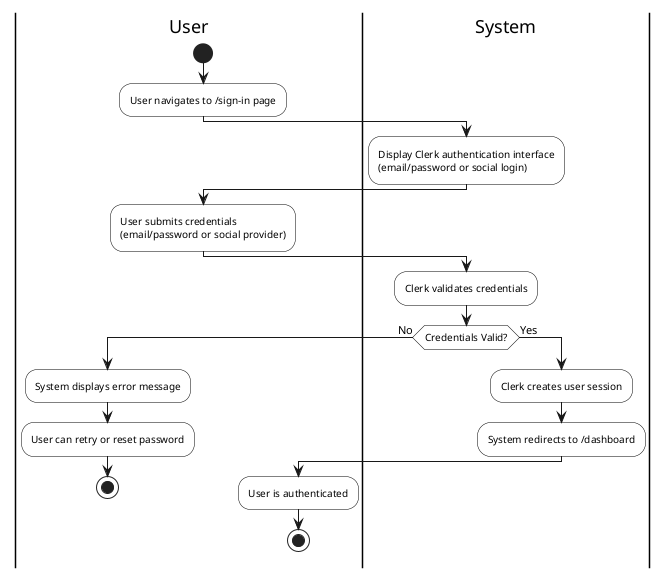

### 2.3.2. Use Case 1: Join Room

This activity diagram illustrates the room joining workflow based on the "Join Room" use case specification, including password validation.

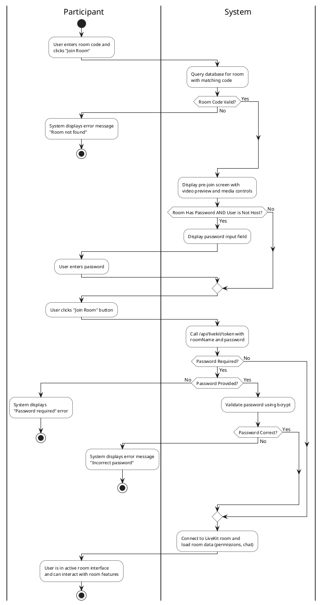

### 2.3.3. Use Case 2: Collaborate on Whiteboard

This activity diagram illustrates the whiteboard collaboration workflow based on the "Collaborate on Whiteboard" use case specification.

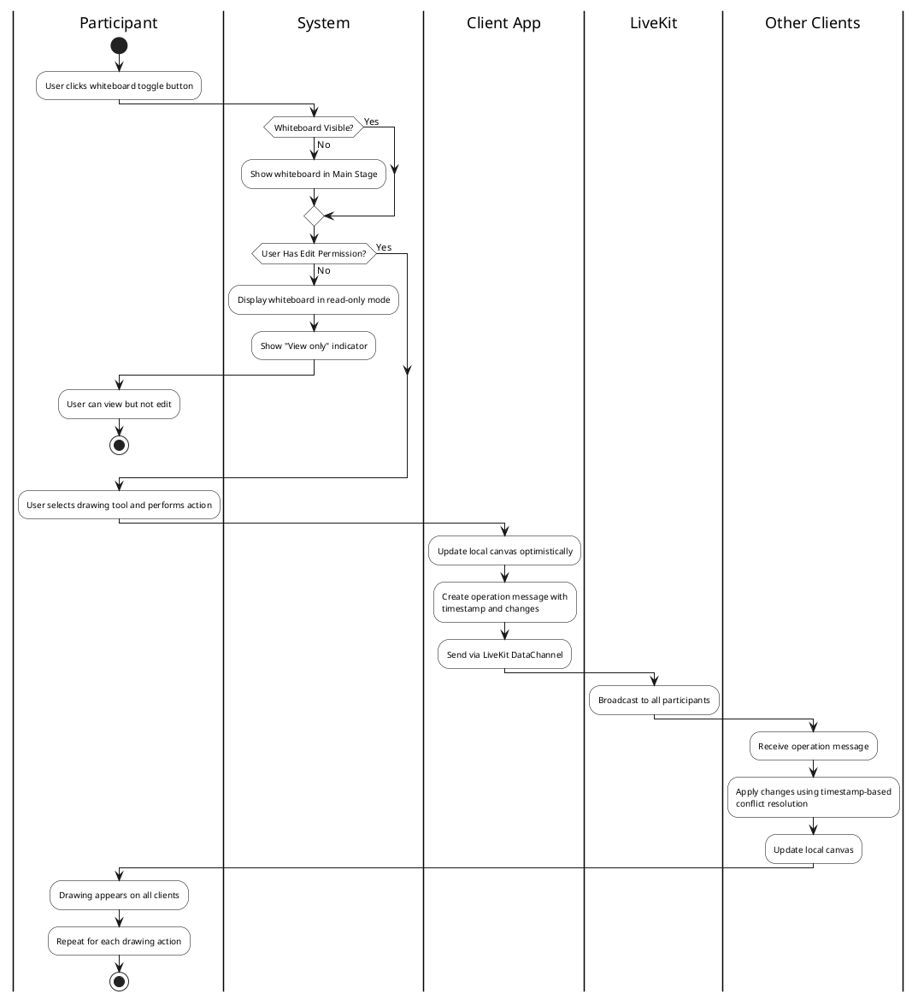

### 2.3.4. Use Case 3: Take Personal Notes

This activity diagram illustrates the personal notes workflow based on the "Take Personal Notes" use case specification.

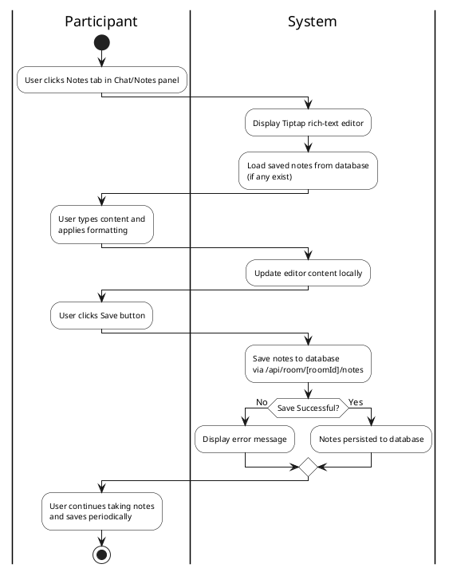

### 2.3.5. Use Case 4: View Session History

This activity diagram illustrates the session history viewing workflow based on the "View Session History" use case specification.

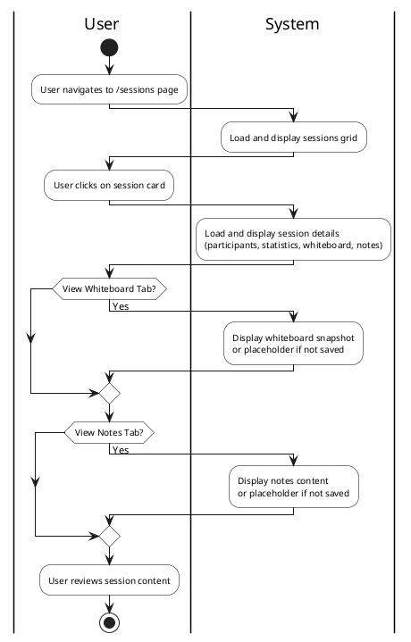

**Swimlanes (Partitions) Used:**
- **User/Participant:** Activities performed by human actors
- **System/Client App/LiveKit/Other Clients:** Activities performed by system components

**Key Features:**
- Each diagram corresponds to a specific use case specification
- Swimlanes clearly separate actor responsibilities
- Decision points reflect alternative flows from specifications
- Parallel activities are shown using partition blocks
- All diagrams use monochrome styling for academic presentation

## 2.4. Sequence Diagrams

Sequence diagrams illustrate the technical interaction flows between system components for key use cases. All diagrams use Mermaid syntax.

### 2.4.1. Use Case 0: Authenticate User

This sequence diagram shows the authentication flow between the user, client application, Next.js server, and Clerk authentication service.

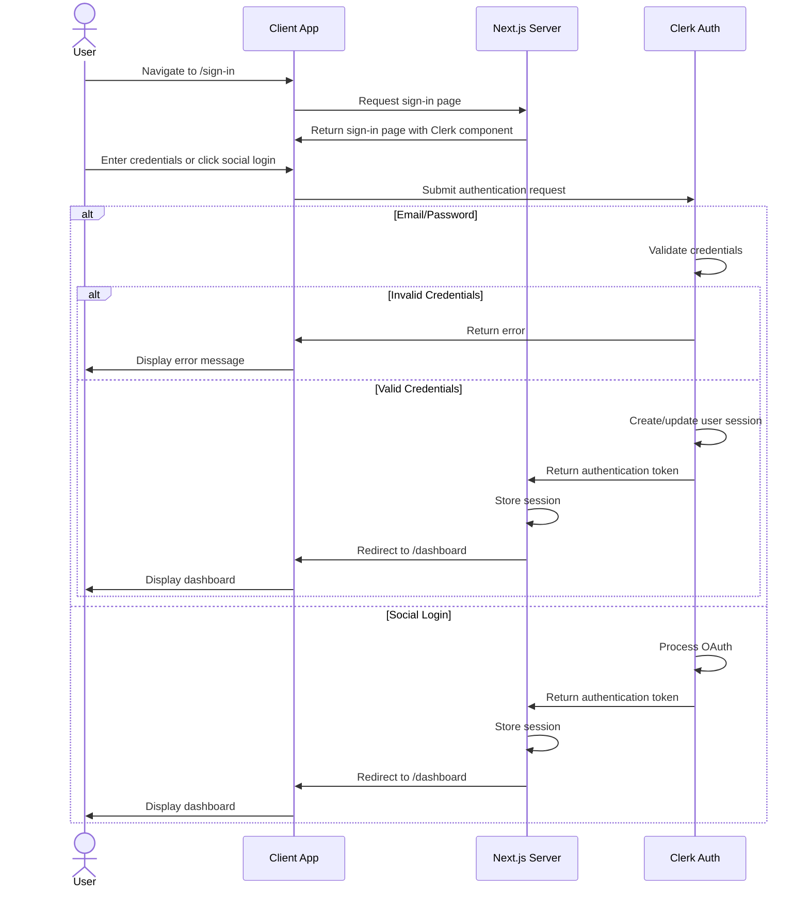

### 2.4.2. Use Case 1: Join Room

This sequence diagram shows the room joining flow including room validation, password verification, LiveKit token generation, and real-time connection establishment.

```mermaid
sequenceDiagram
    actor Participant
    participant Client as Client App
    participant API as Next.js API
    participant DB as MongoDB
    participant LiveKit as LiveKit Server
    
    Participant->>Client: Navigate to /room/[roomCode]
    Client->>API: GET /api/room/validate?code=[roomCode]
    API->>DB: Query room by code
    
    alt Room Invalid (not found or ended)
        API->>Client: Return error (404 or 410)
        Client->>Participant: Display error page
    else Room Valid
        API->>Client: Return room info (hasPassword, isHost)
        Client->>Participant: Display pre-join screen
    end
    
    Participant->>Client: Click "Join Room" (with password if required)
    Client->>API: POST /api/livekit/token {roomName, password}
    
    alt Password Validation (non-host)
        API->>API: Validate password with bcrypt
        alt Invalid Password
            API->>Client: 401 "Invalid password"
            Client->>Participant: Display error
        end
    end
    
    API->>DB: Upsert user data
    API->>API: Generate LiveKit access token
    API->>Client: Return {token}
    
    Client->>LiveKit: Connect to room with token
    LiveKit->>Client: Connection established
    LiveKit->>API: Webhook: room_started, participant_joined
    API->>DB: Update room status and participant record
    
    Client->>API: Load permissions and chat history
    Client->>Participant: Display room interface
```

### 2.4.3. Use Case 2: Collaborate on Whiteboard

This sequence diagram shows the whiteboard collaboration flow with real-time synchronization via LiveKit DataChannel.

```mermaid
sequenceDiagram
    actor Participant
    participant Client as Client App (tldraw)
    participant LiveKit as LiveKit DataChannel
    participant OtherClients as Other Participants
    participant DB as MongoDB
    
    Participant->>Client: Select tool and draw
    Client->>Client: Update local canvas (optimistic)
    
    Client->>Client: Create operation message with timestamp
    Client->>LiveKit: Send whiteboard update via DataChannel
    
    LiveKit->>OtherClients: Broadcast to all participants
    
    par Apply to All Clients
        OtherClients->>OtherClients: Receive operation message
        OtherClients->>OtherClients: Apply changes with timestamp-based conflict resolution
        OtherClients->>OtherClients: Update local canvas
    end
    
    Client->>Participant: Drawing appears on all clients
    
    Note over Participant: Repeat for each drawing action
    
    alt New Participant Joins
        OtherClients->>Client: Request sync
        Client->>Client: Get current snapshot
        Client->>LiveKit: Send sync-response with snapshot
        LiveKit->>OtherClients: Deliver snapshot
        OtherClients->>OtherClients: Apply snapshot to canvas
    end
    
    alt Host Saves Whiteboard
        Participant->>Client: Click save button
        Client->>Client: Get current snapshot
        Client->>DB: POST /api/room/[roomId]/whiteboard
        DB->>Client: Confirm save
        Client->>Participant: Show save confirmation
    end
```

### 2.4.4. Use Case 3: Take Personal Notes

This sequence diagram shows the personal notes workflow with manual save functionality.

```mermaid
sequenceDiagram
    actor Participant
    participant Client as Client App (Tiptap)
    participant NotesAPI as /api/room/[roomId]/notes
    participant DB as MongoDB
    
    Participant->>Client: Click Notes tab
    Client->>NotesAPI: GET /api/room/[roomId]/notes
    NotesAPI->>DB: Query RoomNote by roomId and clerkUserId
    
    alt Notes Exist
        DB->>NotesAPI: Return saved notes content
        NotesAPI->>Client: Return notes JSON
        Client->>Client: Load notes into Tiptap editor
    else No Notes
        DB->>NotesAPI: Return null
        NotesAPI->>Client: Return empty response
        Client->>Client: Display empty editor
    end
    
    Client->>Participant: Display notes editor
    
    Participant->>Client: Type content and apply formatting
    Client->>Client: Update editor content locally
    
    Participant->>Client: Click Save button
    Client->>NotesAPI: POST /api/room/[roomId]/notes {content}
    NotesAPI->>DB: Upsert RoomNote (create or update)
    DB->>NotesAPI: Confirm save
    NotesAPI->>Client: Return success
    Client->>Participant: Show save confirmation
```

### 2.4.5. Use Case 4: View Session History

This sequence diagram shows the session history viewing flow including listing sessions and viewing session details.

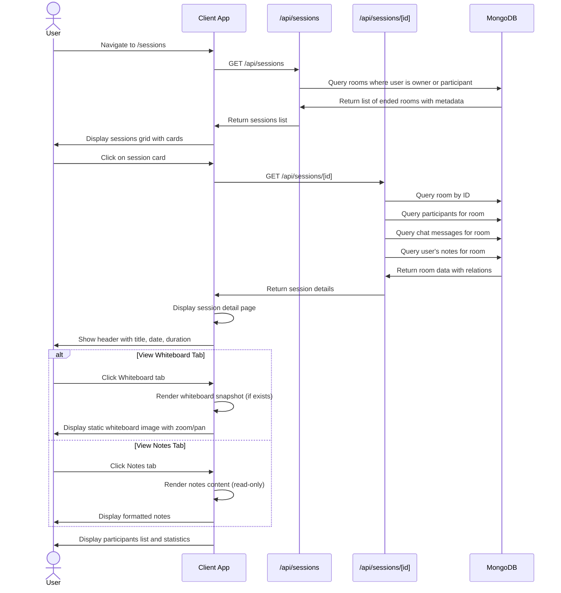

**Key Interaction Patterns:**
1. **Authentication Flow:** User → Client → Server → Clerk → Server → Client → User
2. **Room Joining:** Includes validation, password verification (bcrypt comparison, host exempt), loading permissions/chat, and session initialization
3. **Real-time Whiteboard:** Optimistic updates with LiveKit DataChannel broadcasting and timestamp-based conflict resolution
4. **Personal Notes:** Auto-save with debouncing, per-user storage in database
5. **Session History:** Query sessions by user participation, load session details with whiteboard/notes

## 2.5. State Diagram

State diagrams illustrate the lifecycle of key system entities. The diagrams are broken down into separate views for better understanding and visualization.

### 2.5.1. Room Lifecycle

This diagram shows the lifecycle of a meeting room from creation to end, managed through LiveKit webhooks and API endpoints.

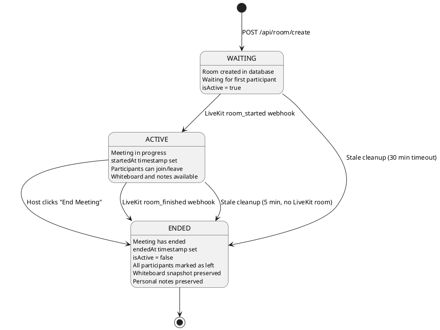

### 2.5.2. Whiteboard Collaboration State

This diagram shows the whiteboard synchronization state machine for real-time collaboration.

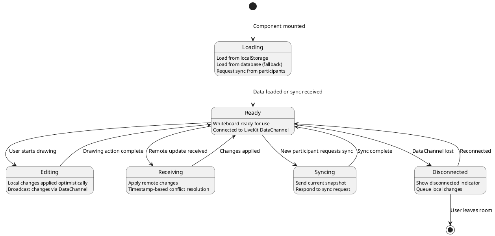

### 2.5.3. Personal Notes State

This diagram shows the personal notes state machine for manual save functionality.

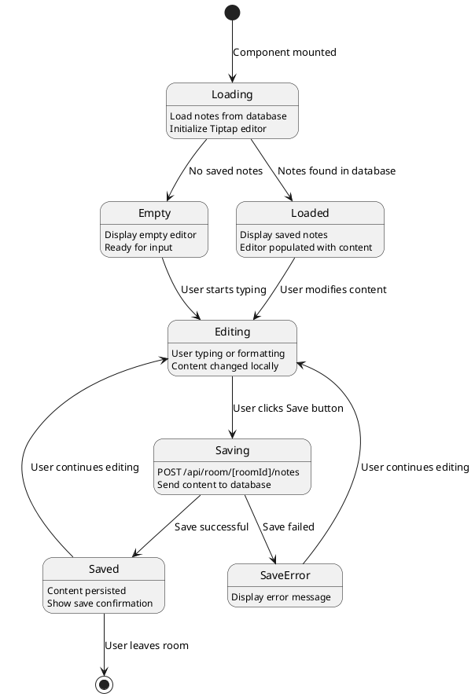

**State Descriptions:**

**Room Lifecycle States:**
- **WAITING:** Initial state when a room is created via `/api/room/create`. Room exists in database with `isActive = true`, waiting for first participant to join via LiveKit.
- **ACTIVE:** Meeting is in progress. Triggered by LiveKit `room_started` webhook when first participant connects. `startedAt` timestamp is set. Participants can freely join and leave. Whiteboard and notes features are available.
- **ENDED:** Meeting has ended. Can be triggered by:
  - Host clicking "End Meeting" button (calls `/api/room/end`)
  - LiveKit `room_finished` webhook (all participants left)
  - Stale room cleanup in `/api/room/validate` (ACTIVE room with no LiveKit room for 5+ minutes, or WAITING room for 30+ minutes)
  - Sets `endedAt` timestamp, `isActive = false`, marks all participants as left. Whiteboard snapshot and personal notes are preserved for session history.

**Whiteboard Collaboration States:**
- **Loading:** Component is loading whiteboard state from localStorage, database, or requesting sync from other participants.
- **Ready:** Whiteboard is ready for use, connected to LiveKit DataChannel for real-time sync.
- **Editing:** User is actively drawing, changes are applied optimistically and broadcast to others.
- **Receiving:** Receiving and applying remote changes from other participants with conflict resolution.
- **Syncing:** Responding to sync requests from new participants joining the room.
- **Disconnected:** DataChannel connection lost, local changes queued until reconnection.

**Personal Notes States:**
- **Loading:** Component is loading notes from database and initializing Tiptap editor.
- **Empty:** No saved notes found, editor displays empty state ready for input.
- **Loaded:** Saved notes loaded from database and displayed in editor.
- **Editing:** User is actively typing or formatting content, changes tracked locally.
- **Saving:** Auto-save triggered (debounced), content being sent to database via API.
- **Saved:** Content successfully persisted to database, save indicator shown.
- **SaveError:** Save operation failed, error indicator displayed, retry attempted.

**State Transitions:**
- Main lifecycle transitions are triggered by user actions (join, leave, end session).
- Whiteboard transitions are triggered by user drawing actions and network events.
- Notes transitions are triggered by user editing and auto-save timer (debounced).
- Conflict resolution uses timestamp-based last-write-wins strategy for whiteboard.

## 2.6. Class Diagram (Data Model)

The class diagram below represents the database schema based on Prisma/MongoDB structure. This diagram illustrates the entities, their attributes, and relationships within the Stoom platform.

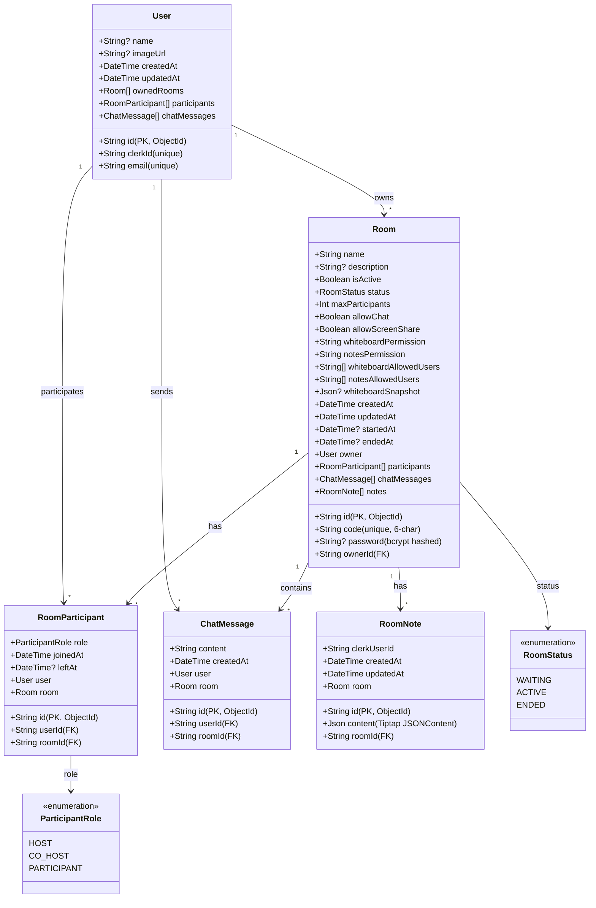

### Entity Descriptions

#### User Entity
The **User** entity represents authenticated users in the system, synced with Clerk authentication. The entity uses MongoDB ObjectId as primary key and stores the Clerk user ID separately for authentication integration.

**Key Attributes:**
- `id`: MongoDB ObjectId primary key
- `clerkId`: Unique Clerk user ID for authentication
- `email`: Unique email address for user identification
- `name`: Optional display name (synced from Clerk)
- `imageUrl`: Optional avatar URL (synced from Clerk)
- `createdAt`: Timestamp of account creation
- `updatedAt`: Timestamp of last update

#### Room Entity
The **Room** entity represents a meeting room created by a Room Host. Each room has a unique 6-character code for joining, a name, and various settings including collaboration permissions. The room tracks its lifecycle through the `status` field (WAITING → ACTIVE → ENDED).

**Key Attributes:**
- `id`: MongoDB ObjectId primary key
- `code`: Unique 6-character room code for joining (e.g., "abc123")
- `name`: Meeting room name (required, set during creation)
- `description`: Optional room description
- `password`: Optional room password for access control (bcrypt hashed, minimum 4 characters when set). Host can set/change/remove password during active session via `/api/room/[roomId]/password` endpoint. Host is exempt from password validation when joining.
- `isActive`: Boolean flag indicating if room is accessible
- `status`: Room lifecycle status (WAITING, ACTIVE, ENDED)
- `maxParticipants`: Maximum allowed participants (default: 50)
- `allowChat`: Boolean flag for chat feature (default: true)
- `allowScreenShare`: Boolean flag for screen sharing (default: true)
- `whiteboardPermission`: Permission level for whiteboard ('open', 'restricted', 'disabled')
- `notesPermission`: Permission level for notes ('open', 'restricted', 'disabled')
- `whiteboardAllowedUsers`: Array of user IDs with explicit whiteboard access
- `notesAllowedUsers`: Array of user IDs with explicit notes access
- `whiteboardSnapshot`: JSON snapshot of tldraw whiteboard state
- `startedAt`: Timestamp when meeting actually started (set by LiveKit webhook)
- `endedAt`: Timestamp when meeting ended
- `ownerId`: Foreign key to User who created the room

#### RoomParticipant Entity
The **RoomParticipant** entity represents the many-to-many relationship between Users and Rooms. This junction table tracks which users participated in which rooms, their role, and join/leave times. Records are created/updated via LiveKit webhooks.

**Key Attributes:**
- `id`: MongoDB ObjectId primary key
- `role`: Participant role (HOST, CO_HOST, PARTICIPANT)
- `joinedAt`: Timestamp when user joined the room
- `leftAt`: Optional timestamp when user left (null if still in room)
- `userId`: Foreign key to User
- `roomId`: Foreign key to Room

#### ChatMessage Entity
The **ChatMessage** entity stores chat messages sent during room sessions. Messages are persisted for room history and can be retrieved for session review.

**Key Attributes:**
- `id`: MongoDB ObjectId primary key
- `content`: Message text content
- `createdAt`: Timestamp when message was sent
- `userId`: Foreign key to User who sent the message
- `roomId`: Foreign key to Room where message was sent

#### RoomNote Entity
The **RoomNote** entity stores personal notes for each user per room. Each user has their own private notes that are not shared with other participants.

**Key Attributes:**
- `id`: MongoDB ObjectId primary key
- `content`: JSON content (Tiptap JSONContent format)
- `clerkUserId`: Clerk user ID who owns these notes
- `roomId`: Foreign key to Room
- `createdAt`: Timestamp when notes were created
- `updatedAt`: Timestamp when notes were last updated

### Enumerations

#### RoomStatus Enum
- **WAITING**: Initial state when room is created, waiting for participants to join
- **ACTIVE**: Meeting is in progress with participants (set by `room_started` webhook)
- **ENDED**: Meeting has ended (set by `room_finished` webhook or manual end)

#### ParticipantRole Enum
- **HOST**: Room owner/creator with full administrative privileges
- **CO_HOST**: Can manage participants and save collaboration data
- **PARTICIPANT**: Regular participant with standard permissions

### Relationship Descriptions

1. **User → Room (1-to-Many):** A User can own multiple Rooms. Each Room has exactly one owner (User). This relationship is represented by `ownedRooms` in User and `owner` in Room.

2. **User → Room (Many-to-Many via RoomParticipant):** A User can participate in multiple Rooms, and a Room can have multiple Users. This many-to-many relationship is implemented through the `RoomParticipant` junction entity.

3. **Room → RoomParticipant (1-to-Many):** A Room has multiple RoomParticipant records, each representing one user's participation in that room.

4. **User → ChatMessage (1-to-Many):** A User can send multiple ChatMessages. Each ChatMessage has exactly one sender (User).

5. **Room → ChatMessage (1-to-Many):** A Room contains multiple ChatMessages. Each ChatMessage belongs to exactly one Room.

6. **Room → RoomNote (1-to-Many):** A Room can have multiple RoomNote records, one per user who took notes in that room.

### Room Lifecycle State Machine

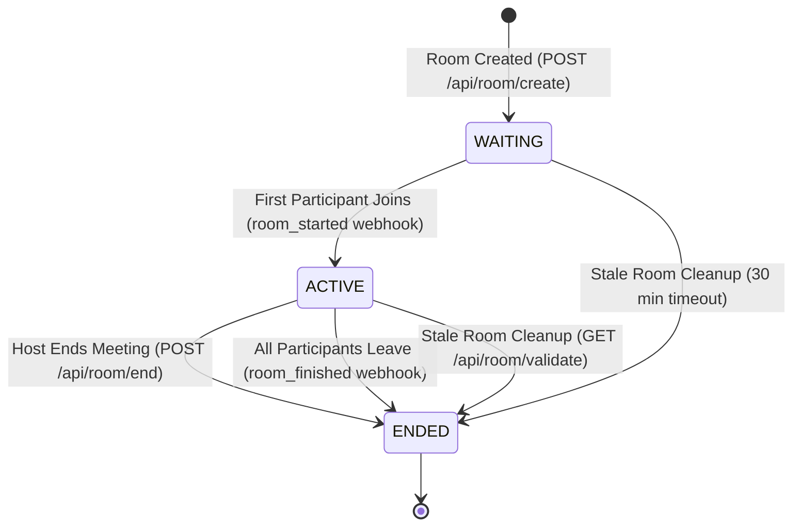

**State Transitions:**
- **WAITING → ACTIVE**: Triggered by LiveKit `room_started` webhook when first participant joins
- **ACTIVE → ENDED**: Triggered by:
  - Host clicking "End Meeting" button (calls `/api/room/end`)
  - LiveKit `room_finished` webhook when all participants leave
  - Stale room cleanup in `/api/room/validate` (5 min threshold)
- **WAITING → ENDED**: Stale room cleanup for rooms that never started (30 min threshold)

This data model supports the functional requirements by providing structured storage for user accounts, room configurations, participant tracking, chat history, whiteboard snapshots, and personal notes, enabling the platform to deliver real-time collaboration features with proper lifecycle management.

## Chapter 3: Implementation

### 3.1 General Interface

The Stoom platform consists of four main interface categories, each serving distinct user needs:

- **Marketing Interface:** Public landing page introducing the platform
- **Authentication Interfaces:** Sign-in and sign-up pages for user access
- **Dashboard Interface:** Main hub for managing meetings and viewing past sessions
- **Sessions Interfaces:** Detailed views of completed sessions with whiteboard and notes
- **Room Interface:** Real-time collaboration environment with video, whiteboard, and chat

All interfaces are built using Next.js 16 App Router with route groups for logical organization. The design system uses violet as the primary brand color, with consistent styling across all pages using Tailwind CSS and shadcn/ui components.

### 3.2 User Interface

**Landing Route:**

Figure 3-1. Landing Page UI

Users can browse the public landing page to learn about the platform features (Real-time Video, Collaborative Whiteboard, Personal Notes). Users can navigate to sign-in or sign-up pages to begin using the platform. No authentication required.

**Authentication Routes:**

Figure 3-2. Authentication UI

Sign In (`/sign-in`): Users can authenticate using email/password credentials or social login providers (Google, GitHub). Upon successful authentication, users are automatically redirected to the dashboard. Sign Up (`/sign-up`): New users can create an account using email/password or social registration. After successful registration, users are redirected to the dashboard to start using the platform.

**Dashboard Route:**

Figure 3-3. Dashboard UI

Users can switch between "Dashboard" and "Sessions" tabs. In the Dashboard tab, users can join existing rooms by entering a room code (opens dialog, navigates to room), create new meetings with custom settings (meeting title, mute on join, camera off, password protection, whiteboard restriction), and view recent sessions in a grid. Users can click "View Details" on any session card to navigate to the session detail page. In the Sessions tab, users can browse all their past session history in a grid layout and access detailed views by clicking session cards. Users can also access their profile settings via the user button in the header.

**Sessions Routes:**

Figure 3-4. Sessions Management UI

Figure 3-5. Session Details UI

Users can view all their past session history in a grid, filter and browse through their history, and navigate to detailed views by clicking on session cards. Detail (`/sessions/[id]`): Users can view comprehensive session information including whiteboard snapshots (if saved), personal notes from the session, participant list with role indicators, and session statistics (duration, participant count, message count). Users can navigate back to the sessions list. Users can switch between Whiteboard and Notes tabs to view different aspects of the session.

**Room Route:**

Figure 3-6. Room Joining UI

Figure 3-7. Room Meeting UI

Before joining, users can test their microphone and camera, toggle media devices on/off, enter room password if required (non-host only), and then join the room. Once in the room, users can toggle microphone on/off, toggle camera on/off, share their screen with other participants, toggle whiteboard visibility, switch between horizontal and vertical layout for screen share and whiteboard, view and interact with the participants list (see who's speaking, mute status, video status, role badges), raise/lower hand to get attention from host, send chat messages to all participants, take personal notes using the rich-text editor, resize panels (participants sidebar, chat/notes panel) with sizes persisted across sessions, collapse/expand the participants sidebar, show/hide chat and notes panel, manage room settings as host/co-host (permissions, password, co-hosts, kick participants), and leave the room (returns to dashboard). The floating dock auto-hides after inactivity and reappears on hover or interaction.

## Conclusion

This capstone project successfully developed Stoom, a comprehensive "Study Together Platform" that integrates Video Conferencing, Collaborative Whiteboard, and Personal Notes into a unified interface, solving the fragmentation problem in online collaborative learning.

### 1. Obtained Results / Achievements

The project has achieved significant milestones:

* **System Completeness:** Successfully integrated Video Conferencing, Collaborative Whiteboard, and Personal Notes into a single interface, eliminating the need to switch between multiple applications during study sessions.

* **Real-time Performance:** Implemented low-latency communication using **LiveKit (SFU architecture)** for media streaming and **LiveKit DataChannel** for whiteboard synchronization, enabling smooth collaboration with multiple concurrent participants. Whiteboard updates are broadcast within 100ms using timestamp-based conflict resolution.

* **Collaborative Whiteboard:** Integrated **tldraw** library for a full-featured collaborative drawing experience with pen, highlighter, eraser, shapes, and text tools. Supports image upload with server-side storage to avoid WebRTC size limits. Real-time synchronization across all participants with automatic state recovery for new joiners.

* **Personal Notes:** Integrated **Tiptap** rich-text editor for personal note-taking with support for headings, lists, bold, italic, and strikethrough formatting. Notes can be saved to the database and persist across sessions.

* **Permission System:** Implemented granular permission controls allowing hosts to manage whiteboard and notes access (open, restricted, disabled) and grant/revoke access to specific participants.

* **Room Security:** Implemented room password protection with bcrypt hashing. Hosts can set, change, or remove passwords during active sessions. Password validation is performed during join with host exemption.

* **Role Management:** Implemented a three-tier role system (Host, Co-Host, Participant) with appropriate permission levels. Hosts can grant/revoke co-host privileges. Co-hosts can manage permissions, kick participants, and end meetings.

* **Participant Management:** Implemented hand raise feature for participants to get attention, with queue management for hosts/co-hosts. Added kick functionality to remove disruptive participants with confirmation dialogs.

* **Modern Architecture:** Built a scalable, type-safe full-stack application using **Next.js 16**, **TypeScript**, **Clerk Auth**, and **Prisma/MongoDB**, ensuring maintainability and performance.

* **UX/UI:** Delivered a modern, dark-mode compatible interface with Resizable Panels and Floating Docks, providing intuitive controls and customizable workspace layouts.

### 2. Limitations and Future Development

#### Limitations

* **Dependency Risks:** Heavy reliance on third-party services (LiveKit, Clerk) creates potential single points of failure if service outages occur.

* **Mobile Experience:** Complex interactions like whiteboard drawing are optimized for Desktop/Tablet and may be difficult to use on small smartphone screens.

* **Offline Mode:** The application requires an active internet connection for all features; no offline support is currently implemented.

* **Whiteboard Persistence:** Whiteboard state must be manually saved by the host; automatic periodic saving is not yet implemented.

#### Future Development / Orientation

* **Mobile App:** Develop a native mobile version (React Native/Flutter) to improve the drawing experience on phones with better touch input handling.

* **AI Features:** Implement AI-powered features such as automatic note summarization, quiz generation from notes, and smart search across session content.

* **Recording & Transcription:** Add meeting recording capabilities with automatic transcription for accessibility and review purposes.

* **Scheduling Integration:** Integrate with Google Calendar and Microsoft Outlook for streamlined study session planning.

* **Pro Features:** Implement cloud storage management (AWS S3) and premium plans for extended meeting durations, higher quality recordings, and advanced collaboration features.

The Stoom platform successfully demonstrates the integration of modern web technologies to address real-world challenges in online collaborative learning. While current limitations exist, the foundation has been established for continued development and enhancement.
