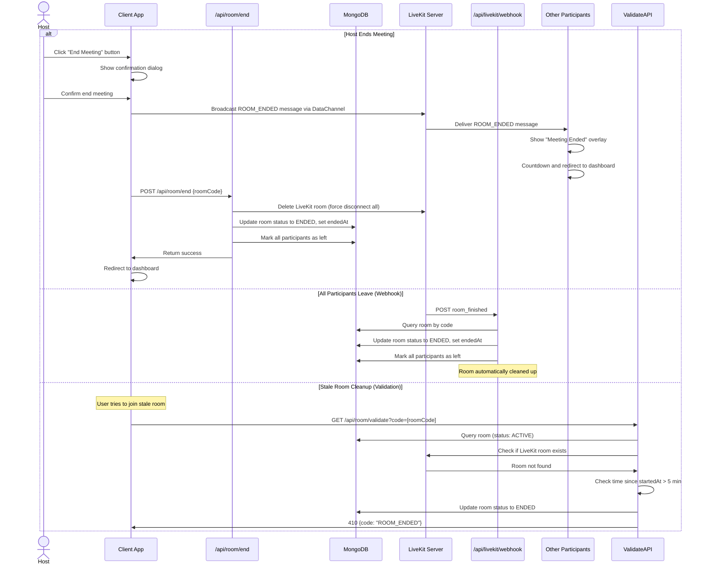
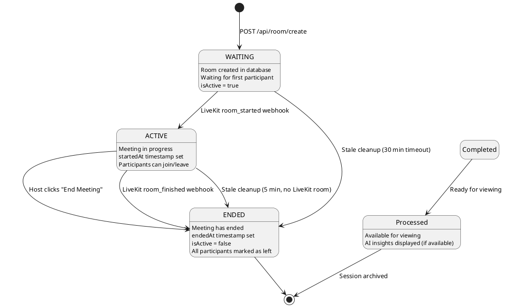
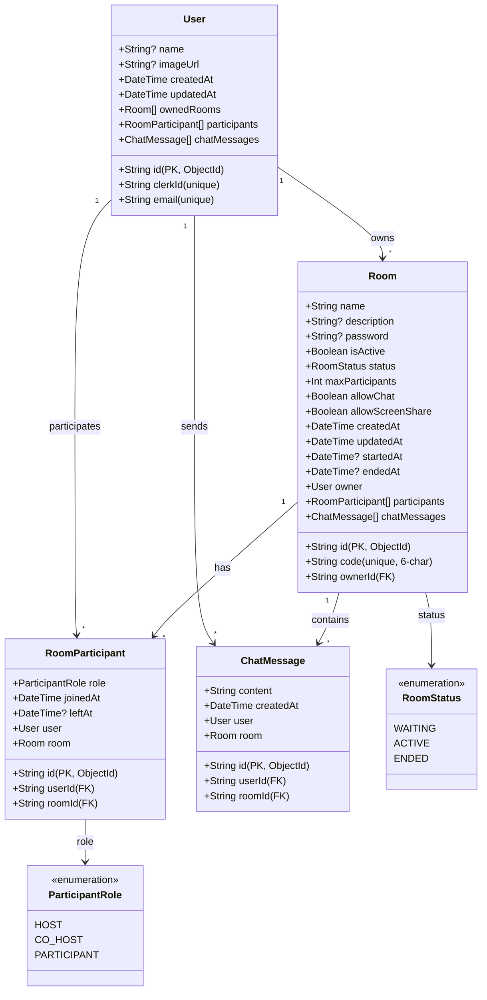
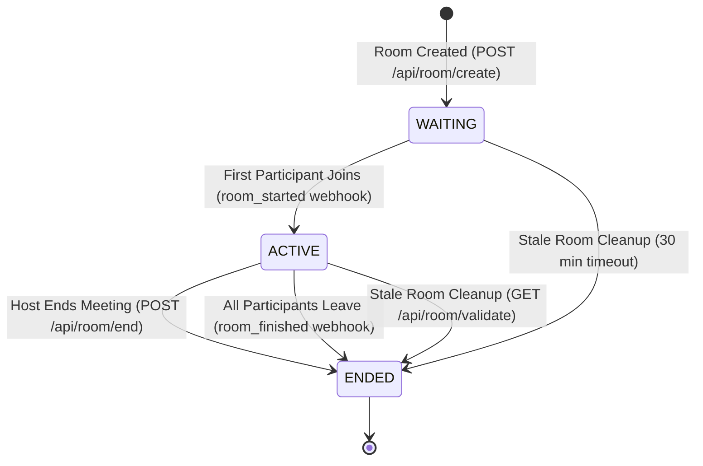

# Chapter 2: System Analysis and Design

## 2.1. System Requirements

### 2.1.1. Actors

The system employs an inheritance-based actor model (Generalization/Specialization) to define user roles and system entities. The base actor is the **User**, which represents any authenticated individual accessing the platform through Clerk authentication. Specialized actors inherit from this base class, each with distinct permissions and responsibilities.

#### Base Actor: User

The **User** actor is the fundamental entity in the system, representing any authenticated individual. All users must authenticate through Clerk before accessing protected features. The User actor has the following base attributes:
- Authentication status (managed by Clerk)
- User ID (Clerk user ID)
- Email address
- Profile information (name, avatar)

#### Specialized Actor: Room Host

The **Room Host** is a specialized User who creates a meeting room. This actor inherits all capabilities of the base User class and additionally possesses administrative privileges within the room context. The Room Host has the following specialized capabilities:
- Create new meeting rooms with custom settings (title, password, media preferences)
- Control room settings during an active session
- Mute or remove participants (future enhancement)
- End the meeting session
- Access all recordings and AI insights for rooms they created

#### Specialized Actor: Participant

The **Participant** is a specialized User who joins an existing meeting room. This actor inherits base User capabilities but has limited administrative rights. The Participant can:
- Join rooms via room code or direct link
- Participate in real-time collaboration (video, audio, whiteboard, notes)
- Send chat messages
- View transcripts and AI insights
- Leave the room at any time
- Cannot modify room settings or control other participants

#### System Actor: AI Assistant

The **AI Assistant** is a non-human system actor that operates autonomously to provide intelligent features. This actor is triggered by specific system events and interacts with external AI services (Google Gemini API). The AI Assistant:
- Processes real-time transcripts during meetings
- Generates AI summaries after session completion
- Extracts key points and takeaways from conversation content
- Provides insights and recommendations based on session data
- Operates asynchronously without direct user interaction

### 2.1.2. Functional Requirements

Functional requirements are organized into logical modules that represent distinct subsystems of the Stoom platform. Each module contains specific requirements labeled with the format **REQ-X.Y**, where X represents the module number and Y represents the requirement number within that module.

#### Module 1: Authentication and User Management

**REQ-1.1:** The system shall authenticate users through Clerk authentication service, supporting email/password and social login methods (Google, GitHub).

**REQ-1.2:** The system shall protect all routes under `(dashboard)` and `(room)` route groups using Clerk middleware, redirecting unauthenticated users to `/sign-in`.

**REQ-1.3:** The system shall provide sign-in and sign-up pages (`/sign-in`, `/sign-up`) with centered card layout, gradient background, and custom violet-themed styling matching the brand identity.

**REQ-1.4:** Upon successful authentication, the system shall redirect users to `/dashboard` automatically.

**REQ-1.5:** The system shall display a UserButton component in the dashboard header, allowing users to access their profile and account settings managed by Clerk.

#### Module 2: Room Management and Navigation

**REQ-2.1:** The system shall provide a "Join with Code" dialog on the dashboard, allowing users to enter a room code and navigate to `/room/[roomCode]`.

**REQ-2.2:** The system shall provide a "New Meeting" dialog that allows Room Hosts to:
- Set a meeting name (required field)
- Optionally set a room password for access control
- Generate a unique 6-character room code via `/api/room/create`
- Persist room to MongoDB with status WAITING
- Navigate to the room after creation

**REQ-2.3:** The system shall validate room access via `/api/room/validate` endpoint:
- Check room existence (return 404 if not found)
- Check room status (return 410 if ENDED or inactive)
- Perform stale room cleanup (mark ACTIVE rooms as ENDED if no LiveKit room exists for 5+ minutes)
- Return room info including: code, name, isHost, hasPassword

**REQ-2.4:** The system shall provide a pre-join screen (`/room/[roomId]`) before entering the main room:
- Display video preview with camera feed (or user avatar if camera off)
- Show user's Clerk profile image when camera is disabled
- Toggle microphone and camera before joining
- Display password input field if room has password (hidden for host)
- Show room name and navigation back to dashboard

**REQ-2.5:** The system shall manage room lifecycle through LiveKit webhooks (`/api/livekit/webhook`):
- `room_started`: Update room status to ACTIVE, set startedAt timestamp
- `room_finished`: Update room status to ENDED, set endedAt timestamp, mark all participants as left
- `participant_joined`: Create/update RoomParticipant record with role (HOST or PARTICIPANT)
- `participant_left`: Update RoomParticipant leftAt timestamp

**REQ-2.6:** The system shall allow Room Hosts to end meetings via "End Meeting" button:
- Display confirmation dialog before ending
- Broadcast ROOM_ENDED message to all participants via LiveKit DataChannel
- Call `/api/room/end` to delete LiveKit room and update database
- Show "Meeting Ended" overlay to all participants with countdown and redirect

#### Module 3: Real-time Collaboration (LiveKit Integration)

**REQ-3.1:** The system shall connect to LiveKit server for real-time video/audio communication:
- Generate LiveKit access tokens via `/api/livekit/token` with user identity and metadata (imageUrl)
- Use `@livekit/components-react` library for room connection and media handling
- Sync user data to MongoDB during token generation (upsert clerkId, name, email, imageUrl)

**REQ-3.2:** The system shall implement a multi-panel layout in the room interface:
- **Participants Sidebar (Left, 288px, collapsible):** Displays room code, participant count, and list with avatars
- **Main Stage (Center, flexible width):** Displays video feeds grid and/or screen share
- **Chat/Notes Panel (Right, resizable):** Tabs for Chat and Notes, can be toggled
- **Transcript Panel (Right, resizable):** Displays real-time transcript, can be toggled

**REQ-3.3:** The system shall use `react-resizable-panels` library to enable users to resize panels by dragging resize handles, with hover effects showing violet color on handles.

**REQ-3.4:** The Participants Sidebar shall:
- Display room code with copy-to-clipboard functionality
- Show participant count badge
- Display each participant with: Clerk profile image (or initial avatar), name, "(You)" indicator for local participant
- Show mic/video status icons (green for enabled, red/gray for disabled)
- Highlight active speaker with violet border and "Speaking" label
- Support collapse/expand functionality

**REQ-3.5:** The Video Feeds View shall:
- Display all participants' video tracks in a responsive grid layout
- Show participant name overlay on each video tile
- Display avatar placeholder when video is disabled
- Highlight active speaker with visual indicator
- Use `@livekit/components-react` VideoTrack component for rendering

**REQ-3.6:** The Screen Share View shall:
- Display screen share track when a participant is sharing
- Show sharer's name in overlay
- Allow any participant to share screen (one at a time)
- Broadcast STOP_SCREEN_SHARE message when another participant wants to take over

**REQ-3.7:** The Chat Panel shall:
- Display scrollable chat messages with sender name, timestamp, and content
- Send messages via LiveKit DataChannel for real-time delivery
- Provide chat input field with Send button
- Auto-scroll to latest messages

**REQ-3.8:** The system shall implement a Floating Dock component at the bottom center:
- Rounded pill shape with backdrop blur and shadow
- Buttons for: Mic toggle, Camera toggle, Screen Share toggle, Chat toggle, Participants toggle, Leave Room
- "End Meeting" button (red) visible only to Room Host
- Visual feedback: violet background for active states, red for destructive actions
- Confirmation dialogs for Leave Room and End Meeting actions

**REQ-3.9:** The system shall handle meeting end scenarios:
- Host clicks "End Meeting": Broadcast ROOM_ENDED message, show overlay to all participants
- Meeting Ended Overlay: Display "Meeting has ended" message with host name, countdown timer, auto-redirect to dashboard
- Participant clicks "Leave Room": Disconnect from LiveKit, redirect to dashboard

#### Module 4: AI Insights and Recordings

**REQ-4.1:** The system shall display real-time transcripts in the Transcript Panel during active meetings, showing speaker name, timestamp, and text content with active entry highlighting.

**REQ-4.2:** The system shall provide a recording detail page (`/recordings/[id]`) with:
- Sticky header showing session title, date, time, and duration
- Two-column layout: left (2/3 width) with tabs for Whiteboard, Transcript, Chat; right (1/3 width) with AI Insight Overview, Participants, and Session Statistics cards

**REQ-4.3:** The AI Insight Overview card shall:
- Display only when `session.hasAIInsights === true`
- Show gradient background (violet-50 to violet-100)
- Include header with Sparkles icon and "AI Generated" badge
- Display Key Points section (bullet list)
- Display Takeaways section (bullet list)

**REQ-4.4:** The Session Statistics card shall display:
- Duration (calculated from session data)
- Participant count
- Message count
- Transcript entry count
- AI Insights availability (badge)

**REQ-4.5:** The Whiteboard tab shall display a placeholder for whiteboard snapshot (aspect-video container) indicating where the final whiteboard state will be shown.

**REQ-4.6:** The Transcript and Chat tabs shall display the same content format as in-room panels, showing historical data from the completed session.

## 2.2. Use Case Diagrams

### 2.2.1. System-Level Use Case Diagram

The system-level use case diagram provides an overall view of the Stoom platform, showing the main functional areas and their relationships with actors. This high-level diagram is simplified to show the three primary use cases, which are then detailed in subsequent subsystem diagrams.


### 2.2.2. Detailed Use Case: Manage Account

This diagram breaks down the "Manage Account" use case from the system-level diagram, showing the detailed interactions for authentication and profile management.


### 2.2.3. Detailed Use Case: Join Room

This diagram breaks down the "Join Room" use case from the system-level diagram, showing the detailed interactions for room creation, joining, and real-time collaboration features.


### 2.2.4. Detailed Use Case: Manage Recordings

This diagram breaks down the "Manage Recordings" use case from the system-level diagram, showing the detailed interactions for viewing session history, recording details, and AI-generated insights.


The actors interact with all three subsystems. The Manage Account Subsystem is accessed first for authentication, after which users can access the Join Room Subsystem to participate in collaborative sessions, and the Manage Recordings Subsystem to review past sessions and AI-generated insights.

### 2.2.5. Detailed Use Case Specifications

Four use cases are detailed below to illustrate the system's core functionality and interaction patterns, including the fundamental authentication use case.

#### Use Case 0: Authenticate User

| **Attribute** | **Description** |
|---------------|-----------------|
| **Use Case Name** | Authenticate User |
| **Actor** | User (base actor) |
| **Description** | A user authenticates with the system through Clerk authentication service, supporting email/password and social login methods (Google, GitHub). Upon successful authentication, the user gains access to protected features of the platform. |
| **Preconditions** | 1. User has a valid account or wishes to create one<br>2. User is on the sign-in or sign-up page<br>3. Clerk authentication service is accessible |
| **Postconditions** | 1. User is authenticated and has an active session<br>2. User is redirected to `/dashboard`<br>3. User can access protected routes and features<br>4. User's authentication status is maintained across the session |
| **Flow** | **Main Flow:**<br>1. User navigates to `/sign-in` or `/sign-up` page<br>2. System displays Clerk authentication interface with custom violet-themed styling<br>3. User selects authentication method (email/password or social login)<br>4. If email/password: User enters email and password, then clicks "Sign In"<br>5. If social login: User clicks social provider button (Google/GitHub) and authorizes<br>6. Clerk validates user credentials or processes social login<br>7. If credentials are valid, Clerk creates/updates user session<br>8. System receives authentication success response from Clerk<br>9. System redirects user to `/dashboard`<br>10. User's authentication status is stored in session<br><br>**Alternative Flow 6a:** If credentials are invalid:<br>6a.1. Clerk returns authentication error<br>6a.2. System displays error message "Invalid credentials"<br>6a.3. User can retry authentication or reset password<br><br>**Alternative Flow 4a:** If user selects "Sign Up" instead:<br>4a.1. User is redirected to `/sign-up` page<br>4a.2. User enters email, password, and confirms password<br>4a.3. Clerk creates new user account<br>4a.4. Continue with step 7<br><br>**Alternative Flow 7a:** If social login authorization is denied:<br>7a.1. User is returned to sign-in page<br>7a.2. User can try again or use email/password method |

#### Use Case 1: Join Room

| **Attribute** | **Description** |
|---------------|-----------------|
| **Use Case Name** | Join Room |
| **Actor** | Participant (specialized User) |
| **Description** | A user joins an existing meeting room by entering a room code or navigating directly to `/room/[roomCode]`. The system validates room existence and status via `/api/room/validate`, displays the pre-join screen with camera/mic preview, requests a LiveKit token, and connects to the LiveKit room for real-time video/audio communication. |
| **Preconditions** | 1. User is authenticated via Clerk<br>2. Room with the provided code exists in the database<br>3. Room status is WAITING or ACTIVE (not ENDED)<br>4. Room `isActive` flag is true<br>5. LiveKit server is running and accessible |
| **Postconditions** | 1. User is connected to LiveKit room with video/audio streams<br>2. User's data is synced to database via token API (upsert)<br>3. RoomParticipant record is created via LiveKit webhook<br>4. Room status transitions to ACTIVE (via `room_started` webhook)<br>5. User can see other participants and interact with room features |
| **Flow** | **Main Flow:**<br>1. User navigates to `/room/[roomCode]` (via dashboard or direct link)<br>2. System calls `/api/room/validate?code=[roomCode]` to check room status<br>3. API validates: room exists, status is not ENDED, isActive is true<br>4. API performs stale room cleanup (checks LiveKit room existence)<br>5. System displays pre-join screen with video preview and media controls<br>6. If room has password and user is not host, system shows password input<br>7. User optionally toggles microphone and camera<br>8. User clicks "Join Room" button<br>9. System calls `/api/livekit/token` with roomName<br>10. Token API upserts user data to database (clerkId, name, email, imageUrl)<br>11. Token API generates LiveKit access token with user identity and metadata<br>12. Client connects to LiveKit room using token<br>13. LiveKit sends `room_started` webhook (if first participant) → Room status = ACTIVE<br>14. LiveKit sends `participant_joined` webhook → RoomParticipant record created<br>15. System displays main room interface with participants sidebar, video feeds, and controls<br><br>**Alternative Flow 3a:** If room does not exist:<br>3a.1. API returns 404 with code "ROOM_NOT_FOUND"<br>3a.2. System displays "Room Not Found" error page<br>3a.3. User can navigate back to dashboard<br><br>**Alternative Flow 3b:** If room has ended:<br>3b.1. API returns 410 with code "ROOM_ENDED"<br>3b.2. System displays "Meeting Ended" error page<br>3b.3. User can navigate back to dashboard<br><br>**Alternative Flow 4a:** If stale room detected (ACTIVE but no LiveKit room for 5+ minutes):<br>4a.1. API marks room as ENDED and returns 410<br>4a.2. Continue with Alternative Flow 3b |

#### Use Case 2: Collaborate on Whiteboard

| **Attribute** | **Description** |
|---------------|-----------------|
| **Use Case Name** | Collaborate on Whiteboard |
| **Actor** | Participant (specialized User) |
| **Description** | A user draws, writes, or adds shapes on the collaborative whiteboard. The system updates the local canvas optimistically, synchronizes changes with other participants in real-time through a WebSocket connection, and persists the final state when the session ends. |
| **Preconditions** | 1. User is in an active room (`/room/[roomId]`)<br>2. Whiteboard panel is visible in Main Stage<br>3. User has permission to edit whiteboard (all participants have edit access)<br>4. WebSocket connection to sync engine (Liveblocks/Y.js) is established |
| **Postconditions** | 1. User's drawing appears on local canvas immediately<br>2. Other participants see the drawing within network latency time<br>3. Whiteboard state is synchronized across all clients<br>4. Final whiteboard snapshot is saved to database when session ends |
| **Flow** | **Main Flow:**<br>1. User clicks whiteboard toggle button in Floating Dock or Stage control bar<br>2. System displays whiteboard in Main Stage (if not already visible)<br>3. User selects drawing tool (pen, eraser, shape, text) from whiteboard toolbar<br>4. User performs drawing action (mouse down, drag, mouse up)<br>5. Client application (tldraw) updates local canvas optimistically<br>6. Client creates operation message containing: tool type, coordinates, color, stroke width, timestamp<br>7. Client sends operation message to Next.js server via WebSocket<br>8. Next.js server validates operation and forwards to sync engine (Liveblocks/Y.js)<br>9. Sync engine applies operation to shared document state<br>10. Sync engine broadcasts operation to all connected clients in the room<br>11. Other clients receive operation and update their local canvas<br>12. All clients display updated whiteboard state<br>13. Steps 4-12 repeat for each drawing action<br><br>**Alternative Flow 3a:** If whiteboard is not visible:<br>3a.1. System shows whiteboard in Main Stage<br>3a.2. Continue with step 3<br><br>**Alternative Flow 7a:** If WebSocket connection is lost:<br>7a.1. Client queues operations locally<br>7a.2. Client attempts to reconnect<br>7a.3. Upon reconnection, client syncs queued operations<br>7a.4. Continue with step 8<br><br>**Alternative Flow 8a:** If operation is invalid (e.g., user lost permission):<br>8a.1. Server rejects operation<br>8a.2. Server sends error message to client<br>8a.3. Client reverts optimistic update<br>8a.4. User sees error notification |

#### Use Case 3: Generate AI Summary

| **Attribute** | **Description** |
|---------------|-----------------|
| **Use Case Name** | Generate AI Summary |
| **Actor** | AI Assistant (System Actor), Room Host (triggers indirectly) |
| **Description** | After a meeting session ends, the system processes the session transcript, calls the Google Gemini API to generate intelligent insights, and saves the AI summary to the database. The summary includes key points and takeaways that are displayed on the recording detail page. |
| **Preconditions** | 1. Meeting session has ended (`endedAt` is set)<br>2. Session has transcript data (array of transcript entries)<br>3. Session has sufficient content (minimum transcript entries threshold met)<br>4. Google Gemini API is accessible and API key is valid |
| **Postconditions** | 1. `MeetingSession.hasAIInsights` is set to `true`<br>2. `MeetingSession.aiSummaryTitle`, `aiKeyPoints`, and `aiTakeaways` are populated<br>3. AI Insight Overview card is visible on recording detail page<br>4. AI badge appears on session card in dashboard |
| **Flow** | **Main Flow:**<br>1. Room Host ends the meeting session (clicks "Leave Room" or ends session)<br>2. System sets `MeetingSession.endedAt` timestamp<br>3. System calculates `durationSeconds` from `startedAt` and `endedAt`<br>4. System triggers background job to generate AI summary<br>5. Background job retrieves `MeetingSession.transcript` (JSON array)<br>6. Background job formats transcript into text prompt for Gemini API<br>7. Background job calls Google Gemini API with prompt requesting:<br>   - Summary title<br>   - List of key points (5-7 items)<br>   - List of takeaways (3-5 items)<br>8. Gemini API processes transcript and returns structured JSON response<br>9. Background job parses API response and extracts summary data<br>10. Background job updates `MeetingSession` record:<br>    - Sets `hasAIInsights = true`<br>    - Sets `aiSummaryTitle`<br>    - Sets `aiKeyPoints` (array)<br>    - Sets `aiTakeaways` (array)<br>11. System saves updated session to database<br>12. When user views recording detail page, system displays AI Insight Overview card<br><br>**Alternative Flow 7a:** If Gemini API call fails (network error, rate limit, invalid response):<br>7a.1. Background job logs error<br>7a.2. Background job retries up to 3 times with exponential backoff<br>7a.3. If all retries fail, job marks session with error flag<br>7a.4. `hasAIInsights` remains `false`<br>7a.5. User sees recording without AI insights<br><br>**Alternative Flow 3a:** If transcript is empty or has insufficient content:<br>3a.1. System skips AI summary generation<br>3a.2. `hasAIInsights` remains `false`<br>3a.3. Continue to step 11 (save session without AI data)<br><br>**Alternative Flow 9a:** If API response format is invalid:<br>9a.1. Background job attempts to parse and extract data with fallback logic<br>9a.2. If parsing fails, job logs error and marks session with error flag<br>9a.3. Continue with alternative flow 7a |

## 2.3. Activity Diagrams

Each use case specification has a corresponding activity diagram that illustrates the workflow using swimlanes (partitions) to separate activities by actor roles. All diagrams use PlantUML syntax with monochrome styling.

### 2.3.1. Use Case 0: Authenticate User

This activity diagram illustrates the authentication workflow based on the "Authenticate User" use case specification.


### 2.3.2. Use Case 1: Join Room

This activity diagram illustrates the room joining workflow based on the "Join Room" use case specification.


### 2.3.3. Use Case 2: Collaborate on Whiteboard

This activity diagram illustrates the whiteboard collaboration workflow based on the "Collaborate on Whiteboard" use case specification.


### 2.3.4. Use Case 3: Generate AI Summary

This activity diagram illustrates the AI summary generation workflow based on the "Generate AI Summary" use case specification.


**Swimlanes (Partitions) Used:**
- **User/Participant/Room Host:** Activities performed by human actors
- **System/Client App/Next.js Server/Sync Engine/Background Job/Google Gemini API:** Activities performed by system components

**Key Features:**
- Each diagram corresponds to a specific use case specification
- Swimlanes clearly separate actor responsibilities
- Decision points reflect alternative flows from specifications
- Parallel activities are shown using partition blocks
- All diagrams use monochrome styling for academic presentation

## 2.4. Sequence Diagrams

Sequence diagrams illustrate the technical interaction flows between system components for key use cases. All diagrams use Mermaid syntax.

### 2.4.1. Use Case 0: Authenticate User

This sequence diagram shows the authentication flow between the user, client application, Next.js server, and Clerk authentication service.


### 2.4.2. Use Case 1: Join Room

This sequence diagram shows the room joining flow including room validation, LiveKit token generation, and real-time connection establishment.

```mermaid
sequenceDiagram
    actor Participant
    participant Client as Client App (/room/[roomId])
    participant ValidateAPI as /api/room/validate
    participant TokenAPI as /api/livekit/token
    participant DB as MongoDB
    participant LiveKit as LiveKit Server
    participant Webhook as /api/livekit/webhook
    
    Participant->>Client: Navigate to /room/[roomCode]
    Client->>ValidateAPI: GET /api/room/validate?code=[roomCode]
    
    ValidateAPI->>DB: Query room by code
    
    alt Room Not Found
        DB->>ValidateAPI: Return null
        ValidateAPI->>Client: 404 {code: "ROOM_NOT_FOUND"}
        Client->>Participant: Display "Room Not Found" error page
    else Room Ended
        DB->>ValidateAPI: Return room (status: ENDED)
        ValidateAPI->>Client: 410 {code: "ROOM_ENDED"}
        Client->>Participant: Display "Meeting Ended" error page
    else Room Valid
        DB->>ValidateAPI: Return room data
        ValidateAPI->>LiveKit: Check if LiveKit room exists
        LiveKit->>ValidateAPI: Return room status
        
        alt Stale Room (ACTIVE but no LiveKit room for 5+ min)
            ValidateAPI->>DB: Update room status to ENDED
            ValidateAPI->>Client: 410 {code: "ROOM_ENDED"}
            Client->>Participant: Display "Meeting Ended" error page
        else Room OK
            ValidateAPI->>Client: 200 {room: {code, name, isHost, hasPassword}}
            Client->>Participant: Display pre-join screen
        end
    end
    
    Participant->>Client: Toggle mic/camera, click "Join Room"
    Client->>TokenAPI: POST /api/livekit/token {roomName}
    
    TokenAPI->>DB: Upsert user (clerkId, name, email, imageUrl)
    DB->>TokenAPI: Return user
    TokenAPI->>TokenAPI: Generate AccessToken with metadata
    TokenAPI->>Client: Return {token}
    
    Client->>LiveKit: Connect to room with token
    LiveKit->>Client: Connection established
    
    LiveKit->>Webhook: POST room_started (if first participant)
    Webhook->>DB: Update room status to ACTIVE, set startedAt
    
    LiveKit->>Webhook: POST participant_joined
    Webhook->>DB: Create/update RoomParticipant record
    
    Client->>Participant: Display main room interface with video feeds
```

### 2.4.2.1. Room End Flow

This sequence diagram shows the room ending flow, including host-initiated end and automatic cleanup via webhooks.



### 2.4.3. Use Case 2: Collaborate on Whiteboard

This sequence diagram shows the simplified whiteboard collaboration flow with real-time synchronization.

```mermaid
sequenceDiagram
    actor Participant
    participant Client as Client App
    participant Server as Next.js Server
    participant Sync as Sync Engine
    participant DB as Database
    
    Participant->>Client: Select tool and draw
    Client->>Client: Update local canvas (optimistic)
    
    Client->>Server: Send operation via WebSocket
    Server->>Server: Validate operation
    Server->>Sync: Forward operation
    
    Sync->>Sync: Apply to shared state
    Sync->>Server: Broadcast to all clients
    
    par Broadcast to All Clients
        Server->>Client: Update (User's client)
        Server->>Client: Update (Other Participant 1)
        Server->>Client: Update (Other Participant 2)
    end
    
    Client->>Client: Apply operation to canvas
    Client->>Participant: Display updated whiteboard
    
    Note over Participant: Repeat for each drawing action
    
    Participant->>Server: End session
    Server->>Sync: Request snapshot
    Sync->>Server: Return whiteboard snapshot
    Server->>DB: Save snapshot to MeetingSession
    DB->>Server: Confirm save
    Server->>Participant: Redirect to dashboard
```

### 2.4.4. Use Case 3: Generate AI Summary

This sequence diagram shows the AI summary generation flow triggered after a session ends.


**Key Interaction Patterns:**
1. **Authentication Flow:** User → Client → Server → Clerk → Server → Client → User
2. **Room Joining:** Includes validation, password check, and session initialization
3. **Real-time Collaboration:** Optimistic updates with WebSocket broadcasting
4. **AI Processing:** Asynchronous background job with retry logic and error handling

## 2.5. State Diagram

State diagrams illustrate the lifecycle of key system entities. The diagrams are broken down into separate views for better understanding and visualization.

### 2.5.1. Room Lifecycle

This diagram shows the lifecycle of a meeting room from creation to end, managed through LiveKit webhooks and API endpoints.



### 2.5.2. AI Processing State

This diagram shows the AI summary generation process that occurs after a session is completed.


**State Descriptions:**

**Room Lifecycle States:**
- **WAITING:** Initial state when a room is created via `/api/room/create`. Room exists in database with `isActive = true`, waiting for first participant to join via LiveKit.
- **ACTIVE:** Meeting is in progress. Triggered by LiveKit `room_started` webhook when first participant connects. `startedAt` timestamp is set. Participants can freely join and leave.
- **ENDED:** Meeting has ended. Can be triggered by:
  - Host clicking "End Meeting" button (calls `/api/room/end`)
  - LiveKit `room_finished` webhook (all participants left)
  - Stale room cleanup in `/api/room/validate` (ACTIVE room with no LiveKit room for 5+ minutes, or WAITING room for 30+ minutes)
  - Sets `endedAt` timestamp, `isActive = false`, marks all participants as left.

**AI Processing State:**
- **Checking:** System checks if transcript has sufficient content for AI processing.
- **Skipped:** AI processing is skipped due to insufficient transcript.
- **CallingAPI:** System calls Google Gemini API to generate summary.
- **Retrying:** System retries API call after failure (up to 3 times).
- **Successful:** API call succeeded, response is being parsed.
- **Updating:** System updates MeetingSession with AI summary data.
- **Failed:** All retry attempts failed, session marked with error flag.

**State Transitions:**
- Main lifecycle transitions are triggered by user actions (join, leave, end session).
- AI processing transitions are triggered automatically after session completion.
- Error handling includes retry logic with maximum 3 attempts.

## 2.6. Class Diagram (Data Model)

The class diagram below represents the database schema based on Prisma/MongoDB structure. This diagram illustrates the entities, their attributes, and relationships within the Stoom platform.



### Entity Descriptions

#### User Entity
The **User** entity represents authenticated users in the system, synced with Clerk authentication. The entity uses MongoDB ObjectId as primary key and stores the Clerk user ID separately for authentication integration.

**Key Attributes:**
- `id`: MongoDB ObjectId primary key
- `clerkId`: Unique Clerk user ID for authentication
- `email`: Unique email address for user identification
- `name`: Optional display name (synced from Clerk)
- `imageUrl`: Optional avatar URL (synced from Clerk)
- `createdAt`: Timestamp of account creation
- `updatedAt`: Timestamp of last update

#### Room Entity
The **Room** entity represents a meeting room created by a Room Host. Each room has a unique 6-character code for joining, a name, and various settings. The room tracks its lifecycle through the `status` field (WAITING → ACTIVE → ENDED).

**Key Attributes:**
- `id`: MongoDB ObjectId primary key
- `code`: Unique 6-character room code for joining (e.g., "abc123")
- `name`: Meeting room name (required, set during creation)
- `description`: Optional room description
- `password`: Optional room password for access control
- `isActive`: Boolean flag indicating if room is accessible
- `status`: Room lifecycle status (WAITING, ACTIVE, ENDED)
- `maxParticipants`: Maximum allowed participants (default: 50)
- `allowChat`: Boolean flag for chat feature (default: true)
- `allowScreenShare`: Boolean flag for screen sharing (default: true)
- `startedAt`: Timestamp when meeting actually started (set by LiveKit webhook)
- `endedAt`: Timestamp when meeting ended
- `ownerId`: Foreign key to User who created the room

#### RoomParticipant Entity
The **RoomParticipant** entity represents the many-to-many relationship between Users and Rooms. This junction table tracks which users participated in which rooms, their role, and join/leave times. Records are created/updated via LiveKit webhooks.

**Key Attributes:**
- `id`: MongoDB ObjectId primary key
- `role`: Participant role (HOST, CO_HOST, PARTICIPANT)
- `joinedAt`: Timestamp when user joined the room
- `leftAt`: Optional timestamp when user left (null if still in room)
- `userId`: Foreign key to User
- `roomId`: Foreign key to Room

#### ChatMessage Entity
The **ChatMessage** entity stores chat messages sent during room sessions. Messages are persisted for room history and can be retrieved for recordings.

**Key Attributes:**
- `id`: MongoDB ObjectId primary key
- `content`: Message text content
- `createdAt`: Timestamp when message was sent
- `userId`: Foreign key to User who sent the message
- `roomId`: Foreign key to Room where message was sent

### Enumerations

#### RoomStatus Enum
- **WAITING**: Initial state when room is created, waiting for participants to join
- **ACTIVE**: Meeting is in progress with participants (set by `room_started` webhook)
- **ENDED**: Meeting has ended (set by `room_finished` webhook or manual end)

#### ParticipantRole Enum
- **HOST**: Room owner/creator with full administrative privileges
- **CO_HOST**: Can manage participants (future enhancement)
- **PARTICIPANT**: Regular participant with standard permissions

### Relationship Descriptions

1. **User → Room (1-to-Many):** A User can own multiple Rooms. Each Room has exactly one owner (User). This relationship is represented by `ownedRooms` in User and `owner` in Room.

2. **User → Room (Many-to-Many via RoomParticipant):** A User can participate in multiple Rooms, and a Room can have multiple Users. This many-to-many relationship is implemented through the `RoomParticipant` junction entity.

3. **Room → RoomParticipant (1-to-Many):** A Room has multiple RoomParticipant records, each representing one user's participation in that room.

4. **User → ChatMessage (1-to-Many):** A User can send multiple ChatMessages. Each ChatMessage has exactly one sender (User).

5. **Room → ChatMessage (1-to-Many):** A Room contains multiple ChatMessages. Each ChatMessage belongs to exactly one Room.

### Room Lifecycle State Machine



**State Transitions:**
- **WAITING → ACTIVE**: Triggered by LiveKit `room_started` webhook when first participant joins
- **ACTIVE → ENDED**: Triggered by:
  - Host clicking "End Meeting" button (calls `/api/room/end`)
  - LiveKit `room_finished` webhook when all participants leave
  - Stale room cleanup in `/api/room/validate` (5 min threshold)
- **WAITING → ENDED**: Stale room cleanup for rooms that never started (30 min threshold)

This data model supports the functional requirements by providing structured storage for user accounts, room configurations, participant tracking, and chat history, enabling the platform to deliver real-time collaboration features with proper lifecycle management.

## Chapter 3: Implementation

The Stoom platform is built using Next.js 16 App Router with route groups for logical organization. This chapter describes the user interactions and functionality available across all routes:

**Marketing Route (`/`):** Users can browse the public landing page to learn about the platform features (Real-time Video, Collaborative Whiteboard, Shared Notes, AI Insights). Users can navigate to sign-in or sign-up pages to begin using the platform. No authentication required.

**Authentication Routes:** **Sign In (`/sign-in`):** Users can authenticate using email/password credentials or social login providers (Google, GitHub). Upon successful authentication, users are automatically redirected to the dashboard. **Sign Up (`/sign-up`):** New users can create an account using email/password or social registration. After successful registration, users are redirected to the dashboard to start using the platform.

**Dashboard Route (`/dashboard`):** Users can switch between "Dashboard" and "Recordings" tabs. In the Dashboard tab, users can join existing rooms by entering a room code (opens dialog, navigates to room), create new meetings with custom settings (meeting title, mute on join, camera off, password protection), and view recent sessions in a grid. Users can click "View Details" on any session card to navigate to the recording detail page. In the Recordings tab, users can browse all their past session recordings in a grid layout and access detailed views by clicking session cards. Users can also access their profile settings via the user button in the header.

**Recordings Routes:** **List (`/recordings`):** Users can view all their past session recordings in a grid, filter and browse through their history, and navigate to detailed views by clicking on session cards. **Detail (`/recordings/[id]`):** Users can view comprehensive session information including whiteboard snapshots, full transcripts with speaker identification and timestamps, complete chat history, AI-generated insights (key points and takeaways when available), participant list with speaking indicators, and session statistics (duration, participant count, message count, transcript entries). Users can navigate back to the recordings list. Users can switch between Whiteboard, Transcript, and Chat tabs to view different aspects of the session.

**Room Route (`/room/[roomId]`):** Before joining, users can test their microphone and camera, toggle media devices on/off, and then join the room. Once in the room, users can toggle microphone on/off, toggle camera on/off, share their screen with other participants, toggle whiteboard visibility, switch between horizontal and vertical layout for screen share and whiteboard, view and interact with the participants list (see who's speaking, mute status, video status), send chat messages to all participants, view and edit collaborative notes, view real-time transcript with active entry highlighting, start/stop recording the meeting (with confirmation), resize panels (participants sidebar, chat/notes panel, transcript panel) with sizes persisted across sessions, collapse/expand the participants sidebar, show/hide chat and notes panel, show/hide transcript panel, and leave the room (returns to dashboard). The floating dock auto-hides after inactivity and reappears on hover or interaction.

**API Routes:** **Clerk Proxy (`/api/clerk/[...clerk]`):** Handles all authentication requests from Clerk service, enabling sign-in, sign-up, and session management functionality throughout the platform.

## Conclusion

This capstone project successfully developed Stoom, a comprehensive "Study Together Platform" that integrates Video Conferencing, Whiteboard, and Shared Notes into a unified interface, solving the fragmentation problem in online collaborative learning.

### 1. Obtained Results / Achievements

The project has achieved significant milestones:

* **System Completeness:** Successfully integrated Video Conferencing, Whiteboard, and Shared Notes into a single interface, eliminating the need to switch between multiple applications during study sessions.

* **Real-time Performance:** Implemented low-latency communication using **LiveKit (SFU architecture)** for media streaming and **Y.js** for collaborative drawing and editing, enabling smooth collaboration with multiple concurrent participants.

* **AI Integration:** Integrated **Google Gemini API** to automatically convert speech to text and generate intelligent summaries with key points and takeaways, transforming raw meeting data into actionable learning materials.

* **Modern Architecture:** Built a scalable, type-safe full-stack application using **Next.js 16**, **TypeScript**, **Clerk Auth**, and **Prisma/MongoDB**, ensuring maintainability and performance.

* **UX/UI:** Delivered a modern, dark-mode compatible interface with Resizable Panels and Floating Docks, providing intuitive controls and customizable workspace layouts.

### 2. Limitations and Future Development

#### Limitations

* **Dependency Risks:** Heavy reliance on third-party services (LiveKit, Clerk, Google Gemini) creates potential single points of failure if service outages occur.

* **AI Latency:** Summary generation for long sessions may experience delays depending on Gemini API response speed, affecting immediate availability of insights.

* **Mobile Experience:** Complex interactions like whiteboard drawing are optimized for Desktop/Tablet and may be difficult to use on small smartphone screens.

* **Offline Mode:** The application requires an active internet connection for all features; no offline support is currently implemented.

#### Future Development / Orientation

* **Mobile App:** Develop a native mobile version (React Native/Flutter) to improve the drawing experience on phones with better touch input handling.

* **Advanced AI Features:** Implement "Quiz Generation" (AI creates quizzes from transcripts) and "Semantic Search" (search for concepts within recorded videos) to transform the platform into a comprehensive learning management system.

* **Scheduling Integration:** Integrate with Google Calendar and Microsoft Outlook for streamlined study session planning.

* **Pro Features:** Implement cloud storage management (AWS S3) and premium plans for extended meeting durations, higher quality recordings, and priority AI processing.

The Stoom platform successfully demonstrates the integration of modern web technologies to address real-world challenges in online collaborative learning. While current limitations exist, the foundation has been established for continued development and enhancement.
